# 第零章 学习目标

- 了解微服务常用的概念
- 了解项目架构演变
- 掌握微服务环境搭建
- 掌握微服务治理组件-Nacos Discovery
- 掌握微服务负载均衡调度组件-Ribbon
- 掌握微服务远程调度组件-Feign
- 掌握微服务流控容错组件-Sentinel
- 掌握微服务网关组件-Gateway
- 掌握微服务链路追踪组件-Sleuth&Zipkin
- 掌握微服务配置中心-Nacos Config
- 开口表述上面所有组件概念、定位、原理与运用(每个10分钟)

# 第一章 微服务概念

## 1.0 一些术语

上课前，科普一下项目开发过程中常出现的术语，方便后续课程内容的理解。

**服务器：**分软件与硬件，软件：类型tomcat这种跑项目的程序， 硬件：用来部署项目的电脑(一般性能比个人电脑好)

**服务：**操作系统上术语：一个程序，开发中术语：一个能对外提供功能的程序

**微服务：**小的服务，一个完整项目可以拆n个子项目，这些子项目能独立运行，独立对为提供功能。

**节点：**微观上：一个服务，宏观上：一台服务器

**垂直扩展：**垂直扩展是指增强单机硬件性能

**水平扩展：**通过增加更多的服务器或者程序实例来分散负载，从而提升存储能力和计算能力。

**容错率：**允许服务器集群(一堆服务器)错误(异常/故障)出现的范围和概率，

**高内聚低耦合：**内聚-->讲究程序功能独立   耦合--->讲究程序间交互，

​       以java为例子：高内聚低耦合：讲究类设计时尽量简单(边界清晰/功能简单)，类与类间交互尽可能少(减少类间的相互调用)

**流量：**有很多种说，开发中说的是访问量(请求次数)

**服务间依赖：**项目与项目间的调用，程序与程序间的调用

**资源调度：**各种资源进行合理有效的调节和测量及分析和使用，开发中资源：服务器，内存，CPU，IO等项目运行需要各种软硬件。

**单点：**唯一，开发中的单点：唯一一个mysql数据库，唯一个服务器

**单点故障：**如果项目/程序部署唯一一个服务器，它挂了，那就玩完了

**宕机：**服务器挂了

## 1.1 单体、分布式、集群

我们学习微服务之前,需要先理解单体、集群、分布式这些概念，这样会帮助我们在学习后面课程会更加容易些.

**单体**

一个系统业务量很小的时候所有的代码都放在一个项目中就好了，然后这个项目部署在一台服务器上就好了。整个项目所有的服务都由这台服务器提供。这就是单机结构。

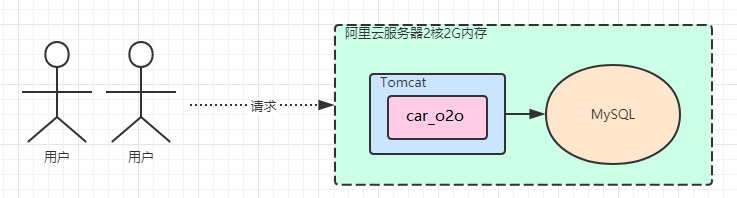

单体应用开发简单,部署测试简单.但是存在一些问题,比如:单点问题,单机处理能力有限,当你的业务增长到一定程度的时候，单机的硬件资源将无法满足你的业务需求。

**分布式**

由于整个系统运行需要使用到Tomcat和MySQL，单台服务器处理的能力有限,2G的内存需要分配给Tomcat和MySQL使用，，随着业务越来越复杂，请求越来越多. 内存越来越不够用了，所以这时候我们就需要进行分布式的部署.

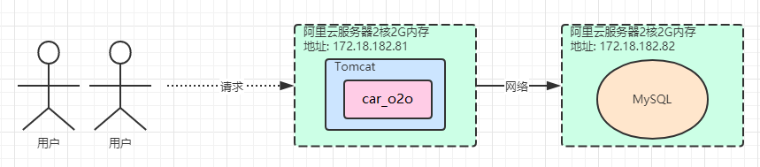

我们进行一个评论的请求，这个请求是需要依赖**分布**在两台不同的服务器的组件[Tomat和MySQL],才能完成的. 所以叫做分布式的系统.

**集群**

在上面的图解中其实是存在问题的，比如Tomcat存在单点故障问题，一旦Tomcat所在的服务器宕机不可用了，我们就无法提供服务了,所以针对单点故障问题，我们会使用集群来解决.那什么是集群模式呢?

单机处理到达瓶颈的时候，你就把单机复制几份，这样就构成了一个“集群”。集群中每台服务器就叫做这个集群的一个“节点”，所有节点构成了一个集群。每个节点都提供相同的服务，那么这样系统的处理能力就相当于提升了好几倍（有几个节点就相当于提升了这么多倍）。

但问题是用户的请求究竟由哪个节点来处理呢？最好能够让此时此刻负载较小的节点来处理，这样使得每个节点的压力都比较平均。要实现这个功能，就需要在所有节点之前增加一个“调度者”的角色，用户的所有请求都先交给它，然后它根据当前所有节点的负载情况，决定将这个请求交给哪个节点处理。这个“调度者”有个牛逼了名字——负载均衡服务器。

**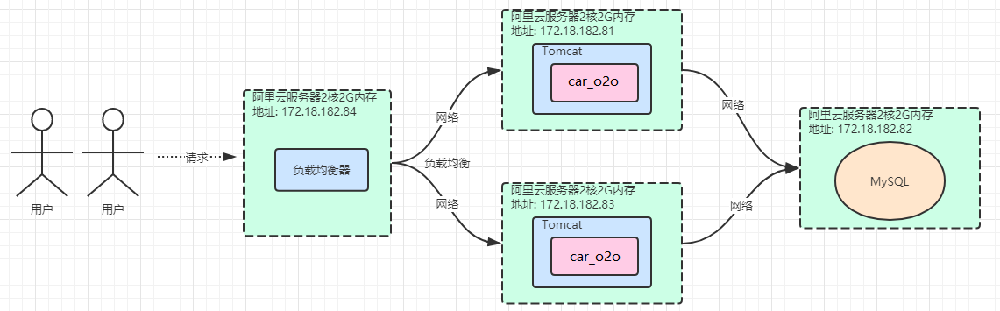**

我们在上面的图中仅展示了Tomcat的集群，如果MySQL压力比较大的情况下，我们也是可以对MySQL进行集群的.

## 1.2 系统架构演变

​    随着互联网的发展，网站应用的规模也不断的扩大，进而导致系统架构也在不断的变化。

   从互联网早起到现在，系统架构大体经历了下面几个过程:

​       **单体应用架构--->垂直应用架构--->分布式架构--->SOA架构--->微服务架构。**

   接下来我们就来了解一下每种系统架构是什么样子的， 以及各有什么优缺点。

### 1.2.1 单体应用架构

​    互联网早期，一般的网站应用流量较小，只需一个应用，将所有功能代码都部署在一起就可以，这

样可以减少开发、部署和维护的成本。

​    比如说一个电商系统，里面会包含很多用户管理，商品管理，订单管理，物流管理等等很多模块，

我们会把它们做成一个web项目，然后部署到一台tomcat服务器上。

**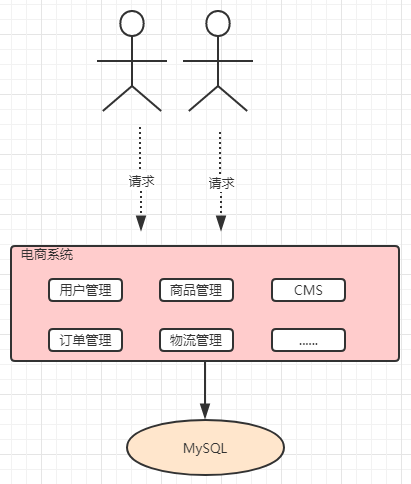**

**优点：**

- 项目架构简单，小型项目的话， 开发成本低

- 项目部署在一个节点上， 维护方便

**缺点：**

- 全部功能集成在一个工程中，对于大型项目来讲不易开发和维护

- 项目模块之间紧密耦合，单点容错率低

- 无法针对不同模块进行针对性优化和水平扩展

### 1.2.2 垂直应用架构

​    随着访问量的逐渐增大，单一应用只能依靠增加节点来应对，但是这时候会发现并不是所有的模块

都会有比较大的访问量.

​    还是以上面的电商为例子， 用户访问量的增加可能影响的只是用户和订单模块， 但是对消息模块

的影响就比较小. 那么此时我们希望只多增加几个订单模块， 而不增加消息模块. 此时单体应用就做不

到了， 垂直应用就应运而生了.

​    所谓的垂直应用架构，就是将原来的一个应用拆成互不相干的几个应用，以提升效率。比如我们可

以将上面电商的单体应用拆分成:

- 电商系统(用户管理 商品管理 订单管理)

- 后台系统(用户管理 订单管理 客户管理)

- CMS系统(广告管理 营销管理)

这样拆分完毕之后，一旦用户访问量变大，只需要增加电商系统的节点就可以了，而无需增加后台

和CMS的节点。

**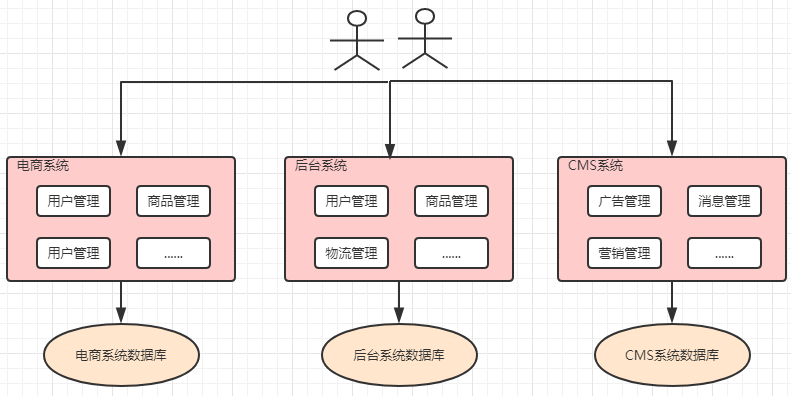**

**优点：**

- 系统拆分实现了流量分担，解决了并发问题，而且可以针对不同模块进行优化和水平扩展

- 一个系统的问题不会影响到其他系统，提高容错率

**缺点：**

- 系统之间相互独立， 无法进行相互调用

- 系统之间相互独立， 会有重复的开发任务

### 1.2.3 分布式架构

​    当垂直应用越来越多，重复的业务代码就会越来越多。这时候，我们就思考可不可以将重复的代码

抽取出来，做成统一的业务层作为独立的服务，然后由前端控制层调用不同的业务层服务呢？

​    这就产生了新的分布式系统架构。它将把工程拆分成表现层和服务层两个部分，服务层中包含业务

逻辑。表现层只需要处理和页面的交互，业务逻辑都是调用服务层的服务来实现。

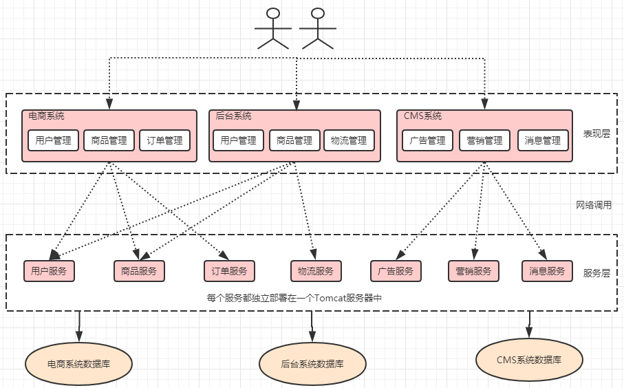

**优点**：

- 抽取公共的功能为服务层，提高代码复用性

**缺点**：

- 系统间耦合度变高，调用关系错综复杂，难以维护

### 1.2.4 SOA架构

​    在分布式架构下，当服务越来越多，容量的评估，小服务资源的浪费等问题逐渐显现，此时需增加

一个调度中心对集群进行实时管理。此时，用于资源调度和治理中心(SOA Service Oriented

Architecture，面向服务的架构)是关键。

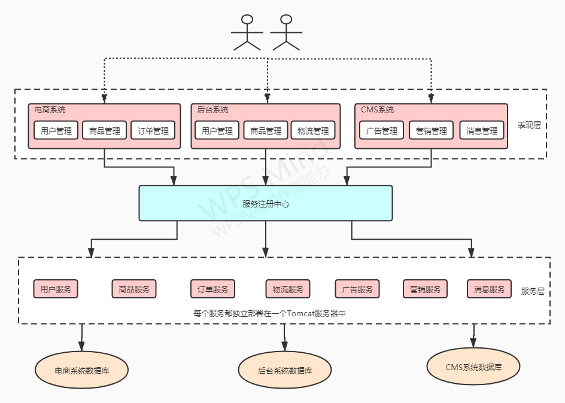

**优点**:

- 使用注册中心解决了服务间调用关系的自动调节

**缺点**:

- 服务间会有依赖关系，一旦某个环节出错会影响较大( 服务雪崩 )

- 服务关系复杂，运维、测试部署困难

### 1.2.5 微服务架构

微服务架构在某种程度上是面向服务的架构SOA继续发展的下一步，它更加强调服务的"彻底拆分"。

**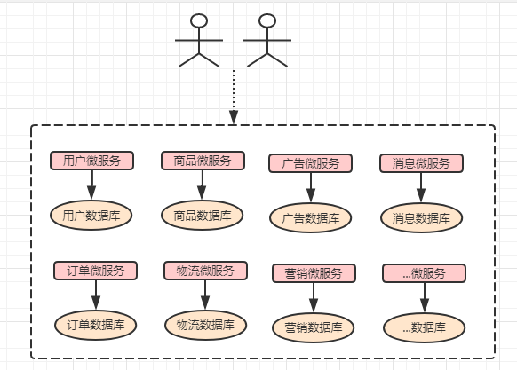**

**优点**：

- 服务原子化拆分，独立打包、部署和升级，保证每个微服务清晰的任务划分，利于扩展

- 微服务之间采用RESTful等轻量级Http协议相互调用

**缺点**：

- 分布式系统开发的技术成本高（容错、分布式事务等）

## 1.3 微服务架构介绍

​    微服务架构， 简单的说就是将单体应用进一步拆分，拆分成更小的服务，每个服务都是一个可以独立运行的项目。

**微服务架构的常见问题**

一旦采用微服务系统架构，就势必会遇到这样几个问题：

- 这么多小服务，如何管理他们？

- 这么多小服务，他们之间如何通讯？

- 这么多小服务，客户端怎么访问他们？

- 这么多小服务，一旦出现问题了，应该如何自处理？

- 这么多小服务，一旦出现问题了，应该如何排错?

对于上面的问题，是任何一个微服务设计者都不能绕过去的，因此大部分的微服务产品都针对每一个问题提供了相应的组件来解决它们。

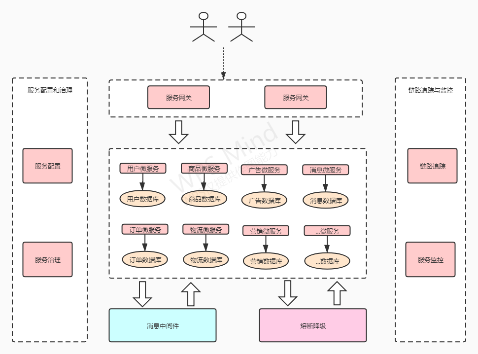

## 1.4 SpringCloud介绍

Spring Cloud是一系列框架的集合。它利用Spring Boot的开发便利性巧妙地简化了分布式系统基础设施的开发，如服务发现注册、配置中心、消息总线、负载均衡、断路器、数据监控等，都可以用Spring Boot的开发风格做到一键启动和部署。

Spring Cloud并没有重复制造轮子，它只是将目前各家公司开发的比较成熟、经得起实际考验的服务框架组合起来，通过Spring Boot风格进行再封装屏蔽掉了复杂的配置和实现原理，最终给开发者留出了一套简单易懂、易部署和易维护的分布式系统开发工具包。

### 1.4.1 SpringBoot和SpringCloud有啥关系?

- SpringBoot专注于快速方便的开发单个个体微服务。

- SpringCloud是关注全局的微服务协调整理治理框架，它将SpringBoot开发的一个个单体微服务整合并管理起来，为各个微服务之间提供，配置管理、服务发现、断路器、路由、事件总线、分布式事务、等等集成服务。

**总结**: SpringBoot专注于快速、方便的开发单个微服务个体，SpringCloud关注全局的服务治理组件的集合。

### 1.4.2 SpringCloud版本名称?

因为Spring Cloud不同其他独立项目，它是拥有很多子项目的大项目。所以它是的版本是 版本名+版本号 （如Greenwich.SR6）。 
版本名：是伦敦的地铁名 
版本号：SR（Service Releases）是固定的 ,大概意思是稳定版本。后面会有一个递增的数字。 
所以 Greenwich.SR6就是Greenwich的第6个Release版本。

### 1.4.3 为什么是SpringCloud Alibaba？

目前，业界比较成熟的服务框架有很多，比如：Hessian、CXF、Dubbo、Dubbox、Spring Cloud、gRPC、thrift等技术实现

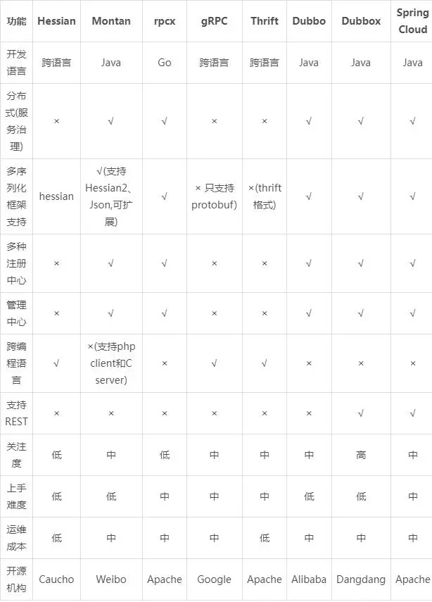*

这里我们为什么选择SpringCloud Alibaba呢，主要因为SpringCloud Netflix的组件：服务注册与发现的 Eureka、服务限流降级的 Hystrix、网关 Zuul都已经停止更新了，当然继续使用是没问题的，只是出现问题，官方不维护，需要自行解决.

# 第二章 微服务环境搭建

## 2.1 一些说明

为了方便讲解SpringCloud课程，我们以电商项目2个核心模块：商品模块、订单模块为例子，一一讲解SpringCloud组件的使用。

学习SpringCloud组件要诀：**不求甚解**

1>能解决啥问题

2>怎么解决(理解原理)

3>API调用(代码怎么写)--建议写3遍--【1遍抄全，2遍思考，3遍掌握】

4>总结，开口表述

**5>类比以前代码结构**

**微服务----**-完整项目按功能分类拆分成n个子项目/子模块，这些子模块能对外提供对应的功能。我们称这些服务为微服务

**落地到代码：单看子项目，每个子项目就是一个完整项目(springmvc项目)**----记住没啥高大上的

**商品微服务**

- 对外提供查询商品列表接口
- 对外提供查询某个商品信息接口

**订单微服务**

- 对外提供创建订单接口

**服务调用**

在微服务架构中，最常见的场景就是微服务之间的相互调用。以下单为例子：客户向订单微服务发起一个下单的请求，在进行保存订单之前需要调用商品微服务查询商品的信息。

**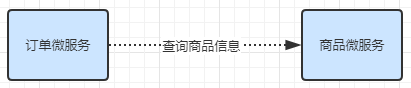**

一般把调用方称为**服务消费者**，把被调用方称为**服务提供者**。

上例中，订单微服务就是服务消费者， 而商品微服务是服务提供者。

## 2.2 技术选型

持久层:  MyBatis-Plus

数据库: MySQL5.7

其他: SpringCloud Alibaba 技术栈

## 2.3 模块设计

--- shop-parent 父工程

​     --- shop-product-api 商品微服务api 【存放商品实体】

​     --- shop-product-server 商品微服务 【端口:808x】

​     --- shop-order-api 订单微服务api 【存放订单实体】

​     --- shop-order-server 订单微服务 【端口:809x】

**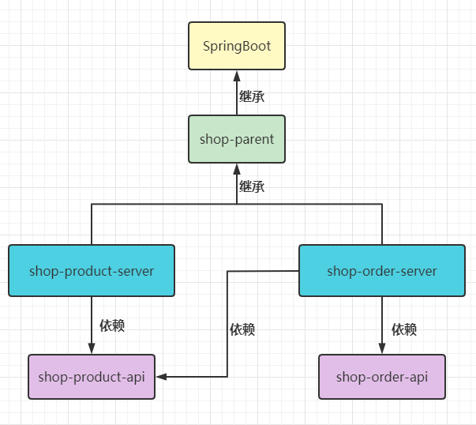**

shop-product-server：子项目-商品微服务，对外提供查询商品信息的接口

shop-order-server：子项目-订单微服务，对外提供创建订单的接口

shop-product-api / shop-order-api : 各自微服务依赖的实体类，为啥要拆开？答案是：**解耦**

此处暂时先记住

## 2.4 版本说明

​    https://github.com/alibaba/spring-cloud-alibaba/wiki/版本说明

**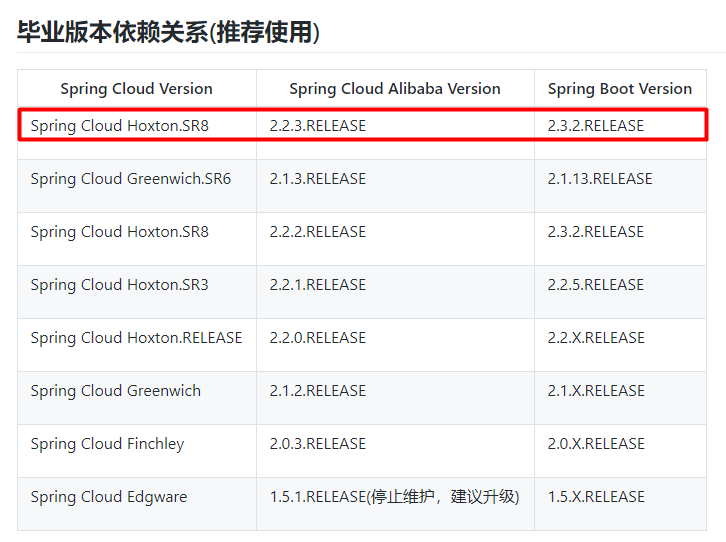**

## 2.5 创建父工程

创建 shop-parent 一个maven工程，然后在pom.xml文件中添加下面内容

```xml
<?xml version="1.0" encoding="UTF-8"?>
<project xmlns="http://maven.apache.org/POM/4.0.0"
         xmlns:xsi="http://www.w3.org/2001/XMLSchema-instance"
         xsi:schemaLocation="http://maven.apache.org/POM/4.0.0 http://maven.apache.org/xsd/maven-4.0.0.xsd">
    <modelVersion>4.0.0</modelVersion>
    <groupId>cn.wolfcode</groupId>
    <artifactId>shop-parent</artifactId>
    <version>1.0.0</version>
    <packaging>pom</packaging>
    <!--父工程-->
    <parent>
        <groupId>org.springframework.boot</groupId>
        <artifactId>spring-boot-starter-parent</artifactId>
        <version>2.3.2.RELEASE</version>
    </parent>
    <!--依赖版本的锁定-->
    <properties>
        <java.version>1.8</java.version>
        <project.build.sourceEncoding>UTF-8</project.build.sourceEncoding>
        <project.reporting.outputEncoding>UTF-8</project.reporting.outputEncoding>
        <spring-cloud.version>Hoxton.SR8</spring-cloud.version>
        <spring-cloud-alibaba.version>2.2.3.RELEASE</spring-cloud-alibaba.version>
    </properties>
    <dependencyManagement>
        <dependencies>
            <dependency>
                <groupId>org.springframework.cloud</groupId>
                <artifactId>spring-cloud-dependencies</artifactId>
                <version>${spring-cloud.version}</version>
                <type>pom</type>
                <scope>import</scope>
            </dependency>
            <dependency>
                <groupId>com.alibaba.cloud</groupId>
                <artifactId>spring-cloud-alibaba-dependencies</artifactId>
                <version>${spring-cloud-alibaba.version}</version>
                <type>pom</type>
                <scope>import</scope>
            </dependency>
        </dependencies>
    </dependencyManagement>
</project>
```

## 2.6 创建商品微服务

**1.创建shop-product-api项目，然后在pom.xml文件中添加下面内容**

```xml
<?xml version="1.0" encoding="UTF-8"?>
<project xmlns="http://maven.apache.org/POM/4.0.0"
         xmlns:xsi="http://www.w3.org/2001/XMLSchema-instance"
         xsi:schemaLocation="http://maven.apache.org/POM/4.0.0 http://maven.apache.org/xsd/maven-4.0.0.xsd">
    <parent>
        <artifactId>shop-parent</artifactId>
        <groupId>cn.wolfcode</groupId>
        <version>1.0.0</version>
    </parent>
    <modelVersion>4.0.0</modelVersion>

    <artifactId>shop-product-api</artifactId>
     <!--依赖-->
    <dependencies>
        <dependency>
            <groupId>com.baomidou</groupId>
            <artifactId>mybatis-plus-boot-starter</artifactId>
            <version>3.4.0</version>
        </dependency>
        <dependency>
            <groupId>org.projectlombok</groupId>
            <artifactId>lombok</artifactId>
        </dependency>
    </dependencies>

</project>
```

**2 创建实体类**

```java
//商品
@Getter
@Setter
@ToString
@TableName("t_product")
public class Product implements Serializable {
    @TableId(type= IdType.AUTO)
    private Long id;//主键
    private String name;//商品名称
    private Double price;//商品价格
    private Integer stock;//库存
}
```

**3.创建shop-product-server项目，然后在pom.xml文件中添加下面内容**

```xml
<?xml version="1.0" encoding="UTF-8"?>
<project xmlns="http://maven.apache.org/POM/4.0.0"
         xmlns:xsi="http://www.w3.org/2001/XMLSchema-instance"
         xsi:schemaLocation="http://maven.apache.org/POM/4.0.0 http://maven.apache.org/xsd/maven-4.0.0.xsd">
    <parent>
        <artifactId>shop-parent</artifactId>
        <groupId>cn.wolfcode</groupId>
        <version>1.0.0</version>
    </parent>
    <modelVersion>4.0.0</modelVersion>

    <artifactId>shop-product-server</artifactId>
    <dependencies>
        <dependency>
            <groupId>org.springframework.boot</groupId>
            <artifactId>spring-boot-starter-web</artifactId>
        </dependency>
        <dependency>
            <groupId>mysql</groupId>
            <artifactId>mysql-connector-java</artifactId>
        </dependency>
        <dependency>
            <groupId>com.alibaba</groupId>
            <artifactId>fastjson</artifactId>
            <version>1.2.56</version>
        </dependency>
        <dependency>
            <groupId>cn.wolfcode</groupId>
            <artifactId>shop-product-api</artifactId>
            <version>1.0.0</version>
        </dependency>
    </dependencies>
</project>
```

**4.编写配置文件application.yml**

```yaml
server:
  port: 8081
spring:
  application:
    name: product-service
  datasource:
    driver-class-name: com.mysql.cj.jdbc.Driver
    url: jdbc:mysql:///shop-product?serverTimezone=UTC&useUnicode=true&characterEncoding=utf-8&useSSL=true
    username: root
    password: admin
```

**5.在数据库中创建shop-product的数据库**

```sql
CREATE TABLE `t_product` (
  `id` bigint NOT NULL AUTO_INCREMENT COMMENT '主键',
  `name` varchar(255) DEFAULT NULL COMMENT '商品名称',
  `price` double(10,2) DEFAULT NULL COMMENT '商品价格',
  `stock` int DEFAULT NULL COMMENT '库存',
  PRIMARY KEY (`id`)
) ENGINE=InnoDB DEFAULT CHARSET=utf8mb3;
```

```sql
INSERT INTO t_product VALUE(NULL,'小米','1000','5000'); 
INSERT INTO t_product VALUE(NULL,'华为','2000','5000'); 
INSERT INTO t_product VALUE(NULL,'苹果','3000','5000'); 
INSERT INTO t_product VALUE(NULL,'OPPO','4000','5000');
```

**6.创建ProductMapper**

```java
package cn.wolfcode.mapper;

import cn.wolfcode.domain.Product;
import com.baomidou.mybatisplus.core.mapper.BaseMapper;

public interface ProductMapper extends BaseMapper<Product> {
}
```

**7.创建ProductService接口和实现类**

```java
public interface IProductService extends IService<Product> {
}
```

```java
@Service
public class ProductServiceImpl extends ServiceImpl<ProductMapper, Product> implements IProductService {
}
```

**8.创建Controller**

```java
package cn.wolfcode.controller;
@RestController
@Slf4j
public class ProductController {
    @Autowired
    private ProductService productService;
    //商品信息查询
    @RequestMapping("/products/{pid}")
    public Product findByPid(@PathVariable("pid") Long pid) {
        log.info("接下来要进行{}号商品信息的查询", pid);
        Product product = productService.findByPid(pid);
        log.info("商品信息查询成功,内容为{}", JSON.toJSONString(product));
        return product;
    }
}
```

**9.编写启动类ProductServer.java**

```java
package cn.wolfcode;

import org.springframework.boot.SpringApplication;
import org.springframework.boot.autoconfigure.SpringBootApplication;

@SpringBootApplication
@MapperScan("cn.wolfcode.mapper")
public class ProductServer {
    public static void main(String[] args) {
        SpringApplication.run(ProductServer.class,args);
    }
}
```

**10.通过浏览器访问服务**

**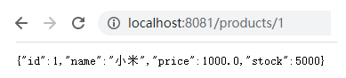**

## 2.7 创建订单微服务

1.创建shop-order-api项目，然后在pom.xml文件中添加下面内容

```xml
<?xml version="1.0" encoding="UTF-8"?>
<project xmlns="http://maven.apache.org/POM/4.0.0"
         xmlns:xsi="http://www.w3.org/2001/XMLSchema-instance"
         xsi:schemaLocation="http://maven.apache.org/POM/4.0.0 http://maven.apache.org/xsd/maven-4.0.0.xsd">
    <parent>
        <artifactId>shop-parent</artifactId>
        <groupId>cn.wolfcode</groupId>
        <version>1.0.0</version>
    </parent>
    <modelVersion>4.0.0</modelVersion>

    <artifactId>shop-order-api</artifactId>
     <!--依赖-->
    <dependencies>
        <dependency>
            <groupId>com.baomidou</groupId>
            <artifactId>mybatis-plus-boot-starter</artifactId>
            <version>3.4.0</version>
        </dependency>
        <dependency>
            <groupId>org.projectlombok</groupId>
            <artifactId>lombok</artifactId>
        </dependency>
    </dependencies>

</project>
```

**2 创建实体类**

```java
package cn.wolfcode.domain;

import com.baomidou.mybatisplus.annotation.IdType;
import com.baomidou.mybatisplus.annotation.TableId;
import lombok.Getter;
import lombok.Setter;

import java.io.Serializable;

//订单
@Getter
@Setter
@ToString
@TableName("t_order")
public class Order implements Serializable {

    @TableId(type = IdType.AUTO)
    private Long id;//订单id
    //用户
    private Long uid;//用户id
    private String username;//用户名
    //商品
    private Long pid;//商品id
    private String productName;//商品名称
    private Double productPrice;//商品单价
    //数量
    private Integer number;//购买数量
}
```

**3.创建shop-order-server项目，然后在pom.xml文件中添加下面内容**

```xml
<?xml version="1.0" encoding="UTF-8"?>
<project xmlns="http://maven.apache.org/POM/4.0.0"
         xmlns:xsi="http://www.w3.org/2001/XMLSchema-instance"
         xsi:schemaLocation="http://maven.apache.org/POM/4.0.0 http://maven.apache.org/xsd/maven-4.0.0.xsd">
    <parent>
        <artifactId>shop-parent</artifactId>
        <groupId>cn.wolfcode</groupId>
        <version>1.0.0</version>
    </parent>
    <modelVersion>4.0.0</modelVersion>

    <artifactId>shop-order-server</artifactId>
    <dependencies>
        <dependency>
            <groupId>org.springframework.boot</groupId>
            <artifactId>spring-boot-starter-web</artifactId>
        </dependency>
        <dependency>
            <groupId>mysql</groupId>
            <artifactId>mysql-connector-java</artifactId>
        </dependency>
        <dependency>
            <groupId>com.alibaba</groupId>
            <artifactId>fastjson</artifactId>
            <version>1.2.56</version>
        </dependency>
        <dependency>
            <groupId>cn.wolfcode</groupId>
            <artifactId>shop-order-api</artifactId>
            <version>1.0.0</version>
        </dependency>
    </dependencies>
</project>
```

**4.编写配置文件application.yml**

```yaml
server:
  port: 8091
spring:
  application:
    name: order-service
  datasource:
    driver-class-name: com.mysql.cj.jdbc.Driver
    url: jdbc:mysql:///shop-order?serverTimezone=UTC&useUnicode=true&characterEncoding=utf-8&useSSL=true
    username: root
    password: admin
```

**5.在数据库中创建shop-order的数据库**

```sql
CREATE TABLE `t_order` (
  `id` bigint NOT NULL AUTO_INCREMENT COMMENT '主键',
  `uid` bigint DEFAULT NULL COMMENT '用户id',
  `username` varchar(255) DEFAULT NULL COMMENT '用户名称',
  `pid` bigint DEFAULT NULL COMMENT '商品id',
  `product_name` varchar(255) DEFAULT NULL COMMENT '商品名称',
  `product_price` double(255,0) DEFAULT NULL COMMENT '商品单价',
  `number` int DEFAULT NULL COMMENT '购买数量',
  PRIMARY KEY (`id`)
) ENGINE=InnoDB DEFAULT CHARSET=utf8mb3;
```

**6.创建OrderMapper**

```java
package cn.wolfcode.mapper;

import cn.wolfcode.domain.Order;
import com.baomidou.mybatisplus.core.mapper.BaseMapper;

public interface OrderMapper extends BaseMapper<Order> {
}
```

**7.创建OrderService接口和实现类**

```java
package cn.wolfcode.service;

import cn.wolfcode.domain.Order;
import com.baomidou.mybatisplus.extension.service.IService;

public interface IOrderService  extends IService<Order> {
}
```

```java
package cn.wolfcode.service.impl;

import cn.wolfcode.domain.Order;
import cn.wolfcode.mapper.OrderMapper;
import cn.wolfcode.service.IOrderService;
import com.baomidou.mybatisplus.extension.service.impl.ServiceImpl;
import org.springframework.stereotype.Service;

@Service
public class OrderServiceImpl extends ServiceImpl<OrderMapper, Order> implements IOrderService {
}
```

**8.创建Controller**

```java
@RestController
@RequestMapping("orders")
public class OrderController {
    @Autowired
    private IOrderService orderService;
    @GetMapping("/save")  //测试方便使用Get方式
    public Order order(Long pid, Long uid){
        return orderService.createOrder(pid, uid);
    }
}
```

**9.编写启动类OrderServer.java**

```java
package cn.wolfcode;

import org.mybatis.spring.annotation.MapperScan;
import org.springframework.boot.SpringApplication;
import org.springframework.boot.autoconfigure.SpringBootApplication;

@SpringBootApplication
@MapperScan("cn.wolfcode.mapper")
public class OrderServer {
    public static void main(String[] args) {
        SpringApplication.run(OrderServer.class,args);
    }
}
```

## 2.8 服务间如何进行远程调用

现在存在一个问题，Order-server服务创建订单操作需要配置商品信息，此时怎么办？

```java
@Service
public class OrderServiceImpl extends ServiceImpl<OrderMapper, Order> implements IOrderService {
    @Override
    public Order createOrder(Long pid, Long uid) {
        Order order = new Order();
        //商品？？
        Product product = null;
        order.setPid(pid);
        order.setProductName(product.getName());
        order.setProductPrice(product.getPrice());

        //用户
        order.setUid(1L);
        order.setUsername("dafei");
        order.setNumber(1);
        super.save(order);
        return order;
    }
}
```

思考，谁能提供商品信息查询逻辑呢？答案：product-server， 问题来了，怎么调用？这里引入一个新问题：服务与服务间如何调用(交互)？

**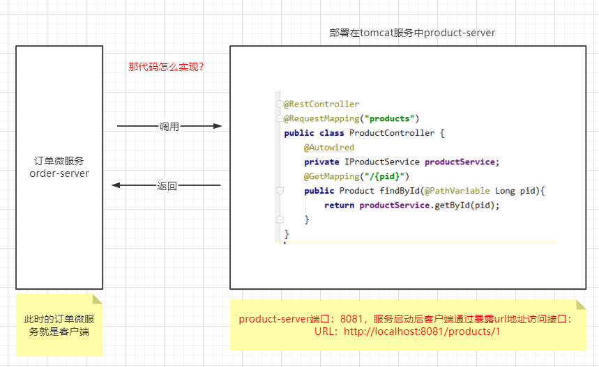**

问题来了，怎么用java代码调用发起http接口调用嗯？？答案是：**RestTemplate**

**RestTempate 是SpringMVC提供专门用于访问http请求的工具类**

1.在shop-order-server项目启动类上添加RestTemplate的bean配置

```java
@SpringBootApplication
@MapperScan("cn.wolfcode.mapper")
public class OrderServer {
    public static void main(String[] args) {
        SpringApplication.run(OrderServer.class,args);
    }

    @Bean
    public RestTemplate restTemplate(){
        return new RestTemplate();
    }
}
```

2.在OrderServiceImpl中注入RestTemplate并实现远程调用

```java
@Service
public class OrderServiceImpl extends ServiceImpl<OrderMapper, Order> implements IOrderService {

    @Autowired
    private RestTemplate restTemplate;

    @Override
    public Order createOrder(Long pid, Long uid) {
        Order order = new Order();
        //商品
        //方案1：通过restTemplate方式
        String url  = "http://localhost:8081/products/" + pid;
        Product product = restTemplate.getForObject(url, Product.class);

        order.setPid(pid);
        order.setProductName(product.getName());
        order.setProductPrice(product.getPrice());

        //用户
        order.setUid(1L);
        order.setUsername("dafei");
        order.setNumber(1);
        System.out.println(order);
        super.save(order);
        return order;
    }
}
```

上面操作确实完成的服务间调用问题，但是代码很不优雅，存在着一定小瑕疵，比如：ip，端口变了呢？

- 一旦服务提供者(商品服务)地址变化，就需要手工修改代码

- 一旦是多个服务(商品服务)提供者，无法实现负载均衡功能

- 一旦服务变得越来越多，人工维护调用关系困难

那怎么办呢， 这时候得引入SpringCloud Alibaba第一个组件：

**组件：**注册中心--**Nacos**

**功能**：动态的实现**服务治理**。

# 第三章 服务治理  Nacos Discovery

## 3.1 什么是服务治理

服务治理是微服务架构中最核心最基本的模块。用于实现各个微服务的**自动化注册与发现**。

**大白话：各种微服务ip/端口的统一管理(CRUD)**

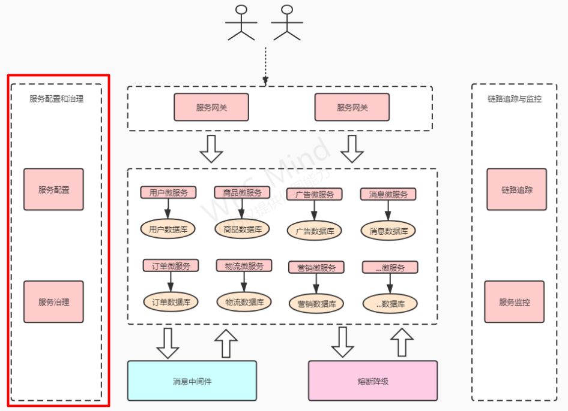

**服务注册：**在服务治理框架中，都会构建一个**注册中心**(管理ip/端口的地方)，每个服务单元向注册中心登记自己提供服

务的详细信息。并在注册中心形成一张服务的清单(**建立服务名与ip/端口映射**)，服务注册中心需要以心跳的方式去监测清单中

的服务是否可用，如果不可用，需要在服务清单中剔除不可用的服务。

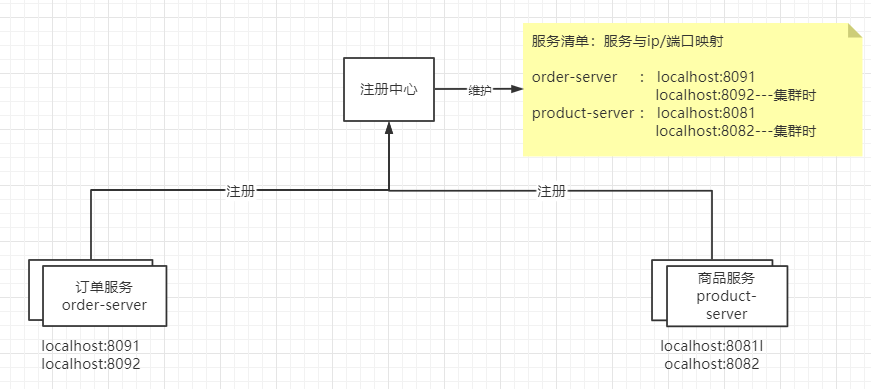

**服务发现：**微服务去咨询注册中心，并获取所有服务清单，实现对具体服务的访问。

**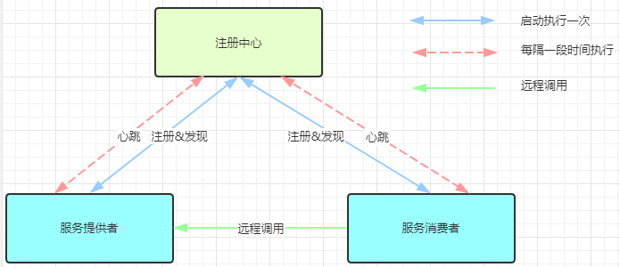**

总结一下：在微服务架构里服务中心主要起到了**协调者**的作用。功能有：

1. 服务发现：
   
   **服务注册**：保存服务提供者和服务调用者的信息
   
   **服务订阅**：服务调用者订阅服务提供者的信息，注册中心向订阅者推送提供者的信息（**拉服务清单**）

2. 服务健康检测
   
   检测服务提供者的健康情况，如果发现异常，执行服务剔除

## 3.2 常见注册中心

- **Zookeeper**
  
  Zookeeper是一个分布式服务框架，是Apache Hadoop 的一个子项目，它主要是用来解决分布式

应用中经常遇到的一些数据管理问题，如：统一命名服务、状态同步服务、集群管理、分布式应用

配置项的管理等。

- **Eureka**
  
  Eureka是Springcloud Netflflix中的重要组件，主要作用就是做服务注册和发现。但是现在已经闭

源

- **Consul**
  
  Consul是基于GO语言开发的开源工具，主要面向分布式，服务化的系统提供服务注册、服务发现

和配置管理的功能。Consul的功能都很实用，其中包括：服务注册/发现、健康检查、Key/Value

存储、多数据中心和分布式一致性保证等特性。Consul本身只是一个二进制的可执行文件，所以

安装和部署都非常简单，只需要从官网下载后，在执行对应的启动脚本即可。

- **Nacos**
  
  Nacos是一个更易于构建云原生应用的动态服务发现、配置管理和服务管理平台。它是 Spring

Cloud Alibaba 组件之一，负责服务注册发现和服务配置。

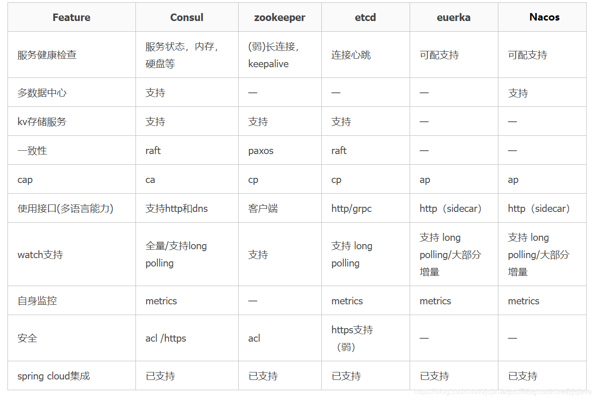

## 3.3 Nacos 简介

Nacos 致力于帮助您发现、配置和管理微服务。Nacos 提供了一组简单易用的特性集，帮助您快速

实现动态服务发现、服务配置、服务元数据及流量管理。

从上面的介绍就可以看出，Nacos的作用就是一个注册中心，用来管理注册上来的各个微服务。

**核心功能点**:

- **服务注册**:  Nacos Client会通过发送REST请求想Nacos Server注册自己的服务，提供自身的元数据，比如IP地址，端口等信息。Nacos Server接收到注册请求后，就会把这些元数据存储到一个双层的内存Map中。

- **服务心跳**:  在服务注册后，Nacos Client会维护一个定时心跳来维持统治Nacos Server,说明服务一致处于可用状态，防止被剔除，默认5s发送一次心跳

- **服务同步**:  Nacos Server集群之间会相互同步服务实例，用来保证服务信息的一致性。

- **服务发现**： 服务消费者(Nacos Client)在调用服务提供的服务时，会发送一个REST请求给Nacos Server,获取上面注册的服务清单，并且缓存在Nacos Client本地,同时会在Nacos Client本地开启一个定时任务拉取服务最新的注册表信息更新到本地缓存。

- **服务健康检查**:  Nacos Server 会开启一个定时任务来检查注册服务实例的健康情况，对于超过15s没有收到客户端心跳的实例会将他的healthy属性设置为false(客户端服务发现时不会发现)，如果某个实例超过30s没有收到心跳，直接剔除该实例(被剔除的实例如果恢复发送心跳则会重新注册)

## 3.4 Nacos实战入门

接下来，我们就在现有的环境中加入nacos，并将我们的两个微服务注册上去。

### 3.4.1 搭建Nacos环境

1. 安装Nacos
   
   ```shell
   下载地址: https://github.com/alibaba/nacos/releases 
   下载zip格式的安装包，然后进行解压缩操作,上课使用的Nacos Server版本是1.3.2
   ```

2. 启动Nacos
   
   ```shell
   #切换目录 
   cd nacos/bin 
   #命令启动 
   startup.cmd -m standalone
   ```

3. 访问Nacos
   
   打开浏览器输入http://localhost:8848/nacos，即可访问服务， 默认密码是nacos/nacos

**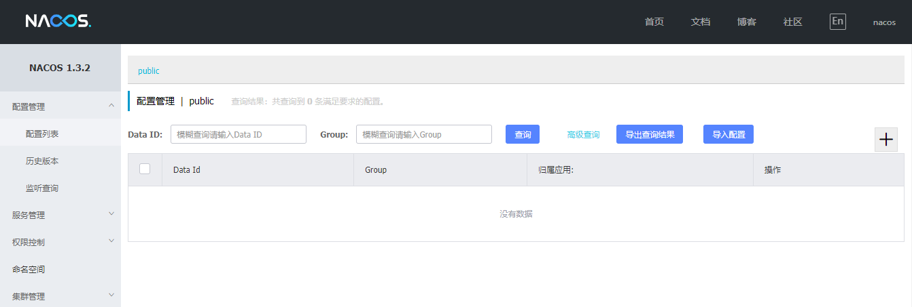**

### 3.4.2 将商品服务注册到Nacos

接下来开始修改 shop-product-server 模块的代码， 将其注册到nacos服务上

1. **在pom.xml中添加Nacos的依赖**

```xml
<!--nacos客户端-->
<dependency>
    <groupId>com.alibaba.cloud</groupId>
    <artifactId>spring-cloud-starter-alibaba-nacos-discovery</artifactId>
</dependency>
```

2. **在主类上添加@EnableDiscoveryClient注解**
   
   ```java
   @SpringBootApplication
   @MapperScan("cn.wolfcode.mapper")
   @EnableDiscoveryClient
   public class ProductServer {
       public static void main(String[] args) {
           SpringApplication.run(ProductServer.class,args);
       }
   }
   ```

3. **在application.yml中添加Nacos服务的地址**
   
   ```yaml
   spring:
     cloud: 
       nacos: 
         discovery: 
           server-addr: localhost:8848
   ```

4. **启动服务， 观察Nacos的控制面板中是否有注册上来的商品微服务**
   
   **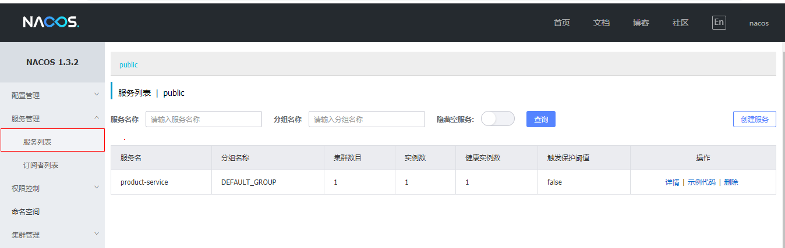**

### 3.4.3 将订单服务注册到Nacos

接下来开始修改 shop-order-server 模块的代码， 将其注册到nacos服务上

1. **在pom.xml中添加Nacos的依赖**

```xml
<!--nacos客户端-->
<dependency>
    <groupId>com.alibaba.cloud</groupId>
    <artifactId>spring-cloud-starter-alibaba-nacos-discovery</artifactId>
</dependency>
```

2. **在主类上添加@EnableDiscoveryClient注解**
   
   ```java
   @SpringBootApplication
   @EnableDiscoveryClient
   public class OrderServer {
       public static void main(String[] args) {
           SpringApplication.run(OrderServer.class,args);
       }
   }
   ```

3. **在application.yml中添加Nacos服务的地址**

```yaml
spring:
  cloud: 
    nacos: 
      discovery: 
        server-addr: localhost:8848
```

4. **启动服务， 观察Nacos的控制面板中是否有注册上来的订单微服务**

**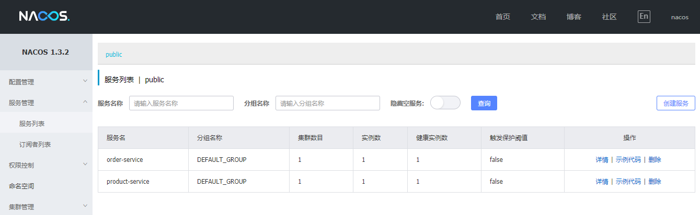**

5. **修改OrderServiceImpl， 实现微服务调用**

```java
@Service
public class OrderServiceImpl extends ServiceImpl<OrderMapper, Order> implements IOrderService {

    @Autowired
    private RestTemplate restTemplate;

    @Autowired
    private DiscoveryClient discoveryClient;

    @Override
    public Order createOrder(Long pid, Long uid) {
        Order order = new Order();
        //商品
        //方案1：通过restTemplate方式
        //String url  = "http://localhost:8081/products/" + pid;
        //Product product = restTemplate.getForObject(url, Product.class);

        //方案2：使用注册中心api方式-discoveryClient
        List<ServiceInstance> instances = discoveryClient.getInstances("product-service");
        ServiceInstance instance = instances.get(0);  //当前只有一个
        String host = instance.getHost();
        int port = instance.getPort();
        String url = "http://" + host + ":" + port + "/products/" + pid;
        Product product = restTemplate.getForObject(url, Product.class);

        order.setPid(pid);
        order.setProductName(product.getName());
        order.setProductPrice(product.getPrice());

        //用户
        order.setUid(1L);
        order.setUsername("dafei");
        order.setNumber(1);
        System.out.println(order);
        super.save(order);
        return order;
    }
}
```

# 第四章 远程调用负载均衡 Ribbon

## 4.0 背景铺垫

微服务项目有一个重要的功能：可以很容易**动态扩缩容**

这里我们不谈容器技术(docker/k8s这些)，传统的扩缩容简单理解就是服务集群。

**扩：**特定时期(比如促销，天灾人祸)一个微服务可能容易挂掉(撑不住/宕机)，那么多开几个就行，此为扩。

**缩：**特定时期过后，多开的微服务可以适当关掉多余的，此为缩

这里考虑扩的问题，以订单与商品服务为例子，

设想一种场景：如果某天公司要促销，单一的订单服务，商品服务不一定能撑得住，该怎么扩容。

扩容常用的手段就是集群，如下：

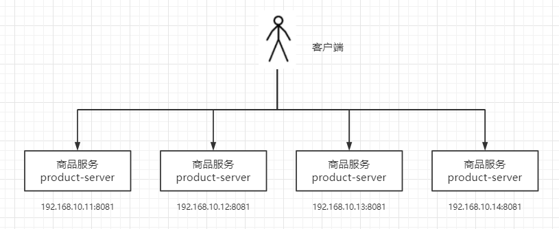

集群存在一个很大问题，客户端发起的请求让哪个微服务处理？解决方案：**负载均衡服务器**

## 4.1 什么是负载均衡

通俗的讲， 负载均衡就是将负载（工作任务，访问请求）进行分摊到多个操作单元（服务器,组件）上进行执行。

根据负载均衡发生位置的不同,一般分为**服务端负载均衡**和**客户端负载均衡**。

**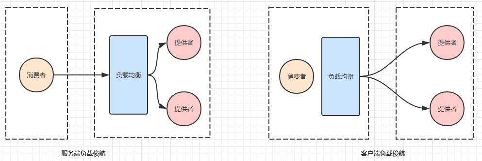**

服务端负载均衡指的是发生在服务提供者一方,比如常见的Nginx负载均衡

**服务端负载均衡**

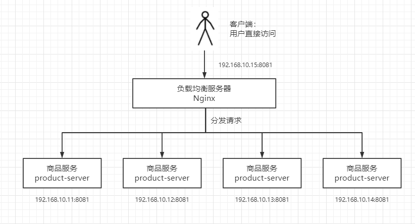

而客户端负载均衡指的是发生在服务请求的一方，也就是在发送请求之前已经选好了由哪个实例处理请求

**客户端负载均衡**

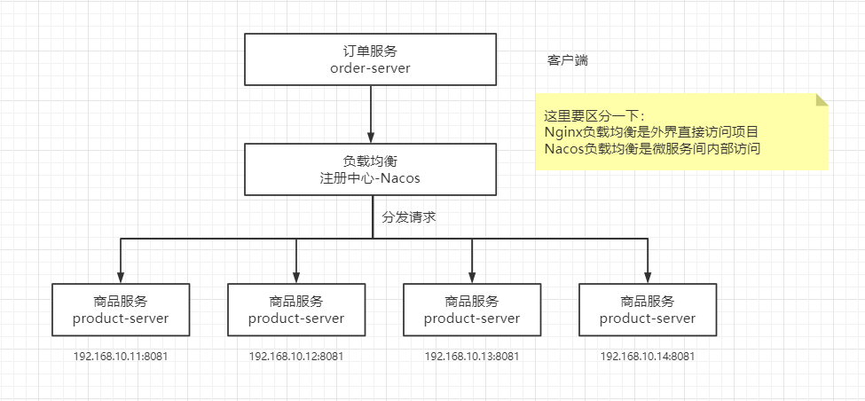

微服务调用关系中一般会选择客**户端负载均衡**，也就是在服务调用的一方来决定服务由哪个提供者执行。

**那问题来：代码上如何实现？**

## 4.2 自定义负载均衡

需求：开启2个商品客户端(localhost:8081/localhost:8082)，这里说明一下，真实开发服务器可定是部署在不同的服务器中，ip不一样，端口可以一样。此时为学习，只有一台电脑，使用不同端口模拟一下。

1. **通过idea再启动一个 shop-product 微服务，设置其端口为8082： -Dserver.port=8082**

   **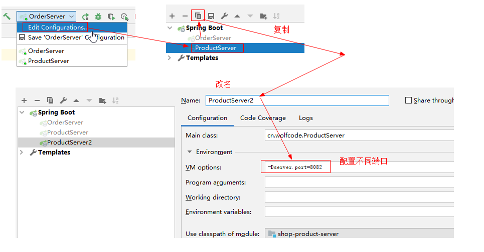**

2. **通过nacos查看微服务的启动情况**
   
   **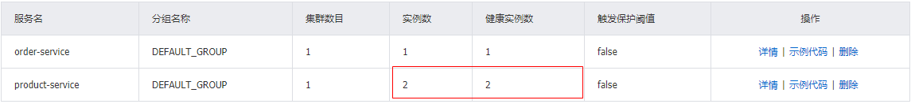**

3. **修改 OrderServiceImpl 的代码，实现负载均衡**
   
   ```java
   @Service
   public class OrderServiceImpl extends ServiceImpl<OrderMapper, Order> implements IOrderService {
   
       @Autowired
       private RestTemplate restTemplate;
   
       @Autowired
       private DiscoveryClient discoveryClient;
   
       @Override
       public Order createOrder(Long pid, Long uid) {
           Order order = new Order();
           //商品
           //方案1：通过restTemplate方式
           //String url  = "http://localhost:8081/products/" + pid;
           //Product product = restTemplate.getForObject(url, Product.class);
   ```

           //方案2：使用注册中心api方式-discoveryClient
           //List<ServiceInstance> instances = discoveryClient.getInstances("product-service");
           //ServiceInstance instance = instances.get(0);  //当前只有一个
           //String host = instance.getHost();
           //int port = instance.getPort();
           //String url = "http://" + host + ":" + port + "/products/" + pid;
           //Product product = restTemplate.getForObject(url, Product.class);
    
           //方案3：使用注册中心api方式-discoveryClient--带负载均衡
           List<ServiceInstance> instances = discoveryClient.getInstances("product-service");
           int index = new Random().nextInt(instances.size());
           ServiceInstance instance = instances.get(index);
           String host = instance.getHost();
           int port = instance.getPort();
           String url = "http://" + host + ":" + port + "/products/" + pid;
    
           System.out.println("从nacos中获取的url地址：" + url);
    
           Product product = restTemplate.getForObject(url, Product.class);
    
           order.setPid(pid);
           order.setProductName(product.getName());
           order.setProductPrice(product.getPrice());
    
           //用户
           order.setUid(1L);
           order.setUsername("dafei");
           order.setNumber(1);
           System.out.println(order);
           super.save(order);
           return order;
       }

   }

```
4. 启动两个服务提供者和一个服务消费者，多访问几次消费者测试效果

**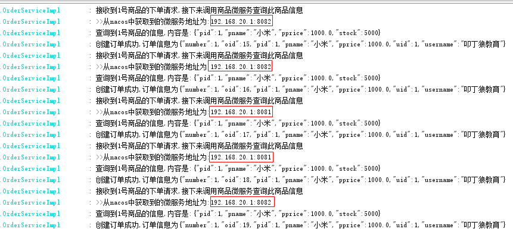**


## 4.3 基于Ribbon实现负载均衡

方案3 负载均衡方式存在问题：编写太麻烦了，有没有更加优雅的方式呢？答案是yes：**Ribbon组件**

**Ribbon**是Spring Cloud的一个组件， 它可以让我们使用一个注解就能轻松的搞定负载均衡

1. **在RestTemplate 的生成方法上添加@LoadBalanced注解**

```java
@Bean
@LoadBalanced
public RestTemplate restTemplate(){
    return new RestTemplate();
}
```

2. **修改OrderServiceImpl服务调用的方法**
   
   ```java
   @Service
   public class OrderServiceImpl extends ServiceImpl<OrderMapper, Order> implements IOrderService {
   
       @Autowired
       private RestTemplate restTemplate;
   
       @Autowired
       private DiscoveryClient discoveryClient;
   
       @Override
       public Order createOrder(Long pid, Long uid) {
           Order order = new Order();
           //商品
           //方案1：通过restTemplate方式
           //String url  = "http://localhost:8081/products/" + pid;
           //Product product = restTemplate.getForObject(url, Product.class);
   ```

           //方案2：使用注册中心api方式-discoveryClient
           //List<ServiceInstance> instances = discoveryClient.getInstances("product-service");
           //ServiceInstance instance = instances.get(0);  //当前只有一个
           //String host = instance.getHost();
           //int port = instance.getPort();
           //String url = "http://" + host + ":" + port + "/products/" + pid;
           //Product product = restTemplate.getForObject(url, Product.class);
    
           //方案3：使用注册中心api方式-discoveryClient--带负载均衡
           //List<ServiceInstance> instances = discoveryClient.getInstances("product-service");
           //int index = new Random().nextInt(instances.size());
           //ServiceInstance instance = instances.get(index);
           //String host = instance.getHost();
           //int port = instance.getPort();
           //String url = "http://" + host + ":" + port + "/products/" + pid;
           //System.out.println("从nacos中获取的url地址：" + url);
           //Product product = restTemplate.getForObject(url, Product.class);
    
           //方案4：使用Ribbon方式--带负载均衡
           String url =  "http://product-service/products/" + pid;
           Product product = restTemplate.getForObject(url, Product.class);
           order.setPid(pid);
           order.setProductName(product.getName());
           order.setProductPrice(product.getPrice());
    
           //用户
           order.setUid(1L);
           order.setUsername("dafei");
           order.setNumber(1);
           System.out.println(order);
           super.save(order);
           return order;
       }

   }

```
3. **为了更直观看到请求是进行负载均衡了，我们修改一下ProductController代码**

```java
@RestController
@RequestMapping("products")
public class ProductController {
    @Autowired
    private IProductService productService;

    @Value("${server.port}")
    private String port;

    @GetMapping("/{pid}")
    public Product findById(@PathVariable Long pid){
        Product product = productService.getById(pid);
        product.setName(product.getName() + "—" + port);
        return product;
    }
}
```

4. **调用订单保存的方法，查看日志.**
   
   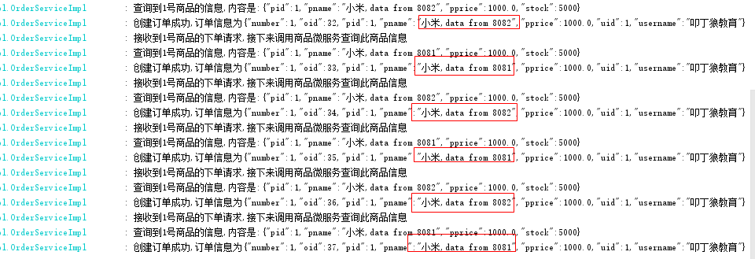

## 4.4 Ribbon支持的负载均衡策略

默认情况下，Ribbon 采用ZoneAvoidanceRule的策略，判断server所在区域的性能和server的可用性选择具体的server

Ribbon内置了多种负载均衡策略，内部负载均衡的顶级接口为**com.netflix.loadbalancer.IRule** , 具体的负载策略如下图所示:

| 策略名                       | 策略描述                                        | 实现说明                                                                                                                                               |
| ------------------------- | ------------------------------------------- | -------------------------------------------------------------------------------------------------------------------------------------------------- |
| BestAvailableRule         | 选择一个最小的并发请求的server                          | 逐个考察Server，如果Server被   了，则忽略，在选择其中ActiveRequestsCount最小的server                                                                                     |
| AvailabilityFilteringRule | 先过滤掉故障实例，再选择并发较小的实例；                        | 使用一个AvailabilityPredicate来包含过滤server的逻辑，其实就就是检查status里记录的各个server的运行状态                                                                             |
| WeightedResponseTimeRule  | 根据相应时间分配一个weight，相应时间越长，weight越小，被选中的可能性越低。 | 一个后台线程定期的从status里面读取评价响应时间，为每个server计算一个weight。Weight的计算也比较简单responsetime 减去每个server自己平均的responsetime是server的权                                     |
| RetryRule                 | 对选定的负载均衡策略机上重试机制。                           | 在一个配置时间段内当选择server不成功，则一直尝试使用subRule的方式选择一个可用的server                                                                                               |
| RoundRobinRule            | 轮询方式轮询选择server                              | 轮询index，选择index对应位置的server                                                                                                                         |
| RandomRule                | 随机选择一个server                                | 在index上随机，选择index对应位置的server                                                                                                                       |
| ZoneAvoidanceRule(默认)     | 复合判断server所在区域的性能和server的可用性选择server        | 使用ZoneAvoidancePredicate和AvailabilityPredicate来判断是否选择某个server，前一个判断判定一个zone的运行性能是否可用，剔除不可用的zone（的所有server），AvailabilityPredicate用于过滤掉连接数过多的Server。 |

我们可以通过修改配置来调整Ribbon的负载均衡策略，在order-server项目的application.yml中增加如下配置:

```yaml
product-service: # 调用的提供者的名称
  ribbon:
    NFLoadBalancerRuleClassName: com.netflix.loadbalancer.RandomRule
```

# 第五章 远程调用Feign

前面使用Ribbon方式实现负载均衡版的远程调用，实现没问题，但是每次都需要手动拼接URL，有点小麻烦，有没有更加优雅的方式呢？答案是yes：**使用Feign**

## 5.1 什么是Feign

​    Feign是Spring Cloud提供的一个声明式的伪Http客户端， 它使得调用远程服务就像调用本地服务一样简单， 只需要创建一个接口并添加一个注解即可。

​    Nacos很好的兼容了Feign， Feign默认集成了 Ribbon， 所以在Nacos下使用Fegin默认就实现了负载均衡的效果。

## 5.2 订单微服务集成Feign

1. **在shop-order-server项目的pom文件加入Fegin的依赖 （注意在服务调用方加）**
   
   ```xml
   <!--fegin组件-->
   <dependency>
       <groupId>org.springframework.cloud</groupId>
       <artifactId>spring-cloud-starter-openfeign</artifactId>
   </dependency>
   ```

2. **在启动类OrderServer.java上添加Fegin的扫描注解,注意扫描路径(默认扫描当前包及其子包)**
   
   ```java
   @SpringBootApplication
   @MapperScan("cn.wolfcode.mapper")
   @EnableDiscoveryClient
   @EnableFeignClients
   public class OrderServer {
       public static void main(String[] args) {
           SpringApplication.run(OrderServer.class,args);
       }
   }
   ```

3. **在shop-order-server项目中新增接口ProductFeignApi**
   
   ```java
   @FeignClient(name = "product-service")
   public interface IProductFeginService {
       @GetMapping("/products/{pid}")
       Product get(@PathVariable("pid") Long pid);
   }
   ```

4. **修改OrderServiceImpl.java的远程调用方法**
   
   ```java
   @Service
   public class OrderServiceImpl extends ServiceImpl<OrderMapper, Order> implements IOrderService {
   
       @Autowired
       private RestTemplate restTemplate;
   
       @Autowired
       private DiscoveryClient discoveryClient;
   
       @Autowired
       private IProductFeginService productFeginService;
   
       @Override
       public Order createOrder(Long pid, Long uid) {
           Order order = new Order();
           //商品
           //方案1：通过restTemplate方式
           //String url  = "http://localhost:8081/products/" + pid;
           //Product product = restTemplate.getForObject(url, Product.class);
   ```

           //方案2：使用注册中心api方式-discoveryClient
           //List<ServiceInstance> instances = discoveryClient.getInstances("product-service");
           //ServiceInstance instance = instances.get(0);  //当前只有一个
           //String host = instance.getHost();
           //int port = instance.getPort();
           //String url = "http://" + host + ":" + port + "/products/" + pid;
           //Product product = restTemplate.getForObject(url, Product.class);
    
           //方案3：使用注册中心api方式-discoveryClient--带负载均衡
           //List<ServiceInstance> instances = discoveryClient.getInstances("product-service");
           //int index = new Random().nextInt(instances.size());
           //ServiceInstance instance = instances.get(index);
           //String host = instance.getHost();
           //int port = instance.getPort();
           //String url = "http://" + host + ":" + port + "/products/" + pid;
           //System.out.println("从nacos中获取的url地址：" + url);
           //Product product = restTemplate.getForObject(url, Product.class);
    
           //方案4：使用Ribbon方式--带负载均衡
           //String url =  "http://product-service/products/" + pid;
           //Product product = restTemplate.getForObject(url, Product.class);
    
           //方案5：使用fegin接口--带负载均衡
           Product product = productFeginService.get(pid);
    
           order.setPid(pid);
           order.setProductName(product.getName());
           order.setProductPrice(product.getPrice());
    
           //用户
           order.setUid(1L);
           order.setUsername("dafei");
           order.setNumber(1);
           System.out.println(order);
           super.save(order);
           return order;
       }

   }

```
5. **重启订单服务，并验证.**


## 5.3 Feign接口使用原理

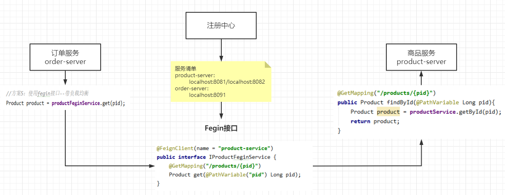


## 5.4 Feign接口定义注意要点

```java
@FeignClient(name = "product-service")
public interface IProductFeginService {
 @GetMapping("/products/{pid}")
 Product get(@PathVariable("pid") Long pid);
}
```

**Fegin接口使用主要点：**

1>@FeignClient 中name为服务提供者在nacos上注册的服务名， 否则报错

```java
Load balancer does not have available server for client:xxxx-service
```

2>@GetMapping("/products/{pid}") 指定接口路径，必须跟服务提供者提供接口url一样，否则报错

```java
feign.FeignException$NotFound: [404] during [GET] to [http://xxx-service/xxx] 
```

3> 定义接口参数：如果使用了参数路径方式访问，需要使用@PathVariable("pid") 明确指定路径参数，否则报错

```java
feign.FeignException$NotFound: [404] during [GET] to [http://xxx-service/xxx] 
```

4>定义接口参数：如果使用普通方式访问，参数需要使用@RequestParam标记，否则报错

```java
feign.FeignException$MethodNotAllowed: [405] during [GET] to [http://xxxx-service/xxxx?xxx=1]
```

5>定义接口参数：如果是对象参数，参数需要使用@RequestBody标记（注意fegin接口，controler接口都要），否则报错

```java
参数无法获取
```

6>定义接口参数：如果是对象，可以使用@SpringQueryMap替换上面的@RequestBody

7>定义接口参数：如果需要进行文件上传，需要使用@RequestPart注解标记

8>Feign接口调用默认连接时间是1s，如果电脑较慢，开发中可以配置长一点时间

注意：后面学sentinel 时候，不要配置，会影响观测效果

```yaml
feign:
  client:
    config:
      default:
        connectTimeout: 5000  #连接时间，单位毫秒
        readTimeout: 5000     #操作时间
```

# 第六章 服务熔断降级 Sentinel

微服务架构应用设计目的为了应对高并发环境，那问题来，高并发环境会带来啥问题，微服务架构设计时需要考虑啥预防性操作？

## 6.1 高并发带来的问题

在微服务架构中，我们将业务拆分成一个个的服务，服务与服务之间可以相互调用，但是由于网络原因或者自身的原因，服务并不能保证服务的100%可用，如果单个服务出现问题，调用这个服务就会出现网络延迟，此时若有大量的网络涌入，会形成任务堆积，最终导致服务瘫痪。

**接下来，我们来模拟一个高并发的场景**

1. **在订单服务中新建SentinelController.java**
   
   ```java
   @RestController
   public class SentinelController {
       @RequestMapping("/sentinel1")
       public String sentinel1(){
           //模拟一次网络延时
           try {
               TimeUnit.SECONDS.sleep(1);
           } catch (InterruptedException e) {
               e.printStackTrace();
           }
           return "sentinel1";
       }
       @RequestMapping("/sentinel2")
       public String sentinel2(){
           return "测试高并发下的问题";
       }
   }
   ```

2. **修改配置文件中tomcat的并发数**
   
   ```yaml
   server:
     port: 8091
     tomcat:
       threads:
         max: 10 #tomcat的最大并发值修改为10,
   ```

3. **接下来使用压测工具,对请求进行压力测试**
   
   下载地址https://jmeter.apache.org/
   
   - 第一步：修改配置，并启动软件
     
     进入bin目录,修改jmeter.properties文件中的语言支持为language=zh_CN，然后点击jmeter.bat
     
     启动软件。
     
     **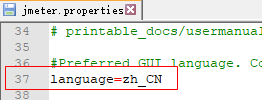**
     
     **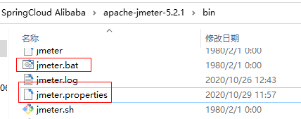**
   
   - 第二步：添加线程组
     
     **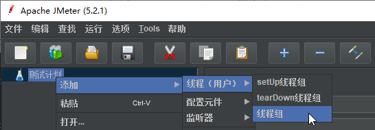**
   
   - 第三步：配置线程并发数
     
     **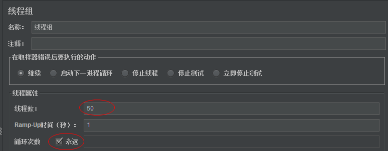**
   
   - 第四步：添加Http请求
     
     **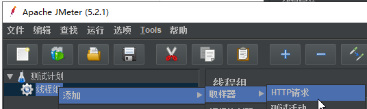**
   
   - 第五步：配置取样，并启动测试
     
     **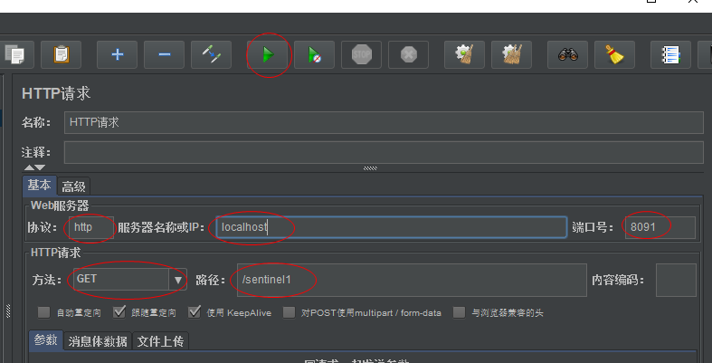**
   
   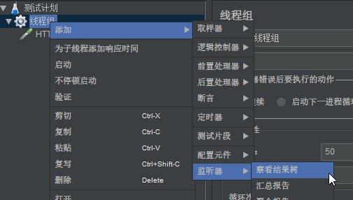
   
   - 第六步：访问 http://localhost:8091/sentinel2 观察结果

   **结论**:此时会发现, 由于sentinel1方法囤积了大量请求, 导致sentinel2方法的访问出现了问题，这就是服务雪

   崩的雏形。

## 6.2 服务器雪崩效应

   前面同一个服务器不同接口间，当一个接口高频访问耗费完资源会影响到其他接口正常使用，如果将这个场景扩展到不同微服务间会怎么样呢？答案：**服务器雪崩**。

   ​    在分布式系统中,由于网络原因或自身的原因,服务一般无法保证 100% 可用。如果一个服务出现了问题，调用这个服务就会出现线程阻塞的情况，此时若有大量的请求涌入，就会出现多条线程阻塞等待，进而导致服务瘫痪。

   ​    由于服务与服务之间的依赖性，故障会传播，会对整个微服务系统造成灾难性的严重后果，这就是服务故障的 “**雪崩效应**” 。

- 情景1: 微服务之间相互调用,关系复杂,正常情况如下图所示:
  
  **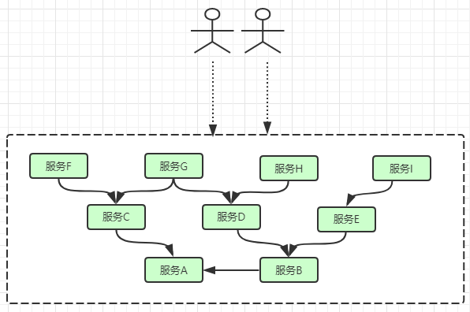**

- 情景2：某个时刻，服务A挂了，服务B和服务C依然在调用服务A
  
  **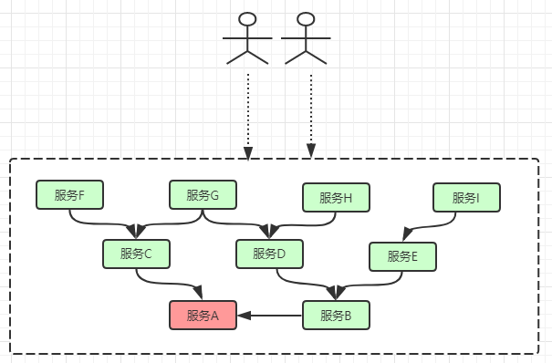**

- 情景3:由于服务A挂了,导致服务C和服务B无法得到服务A的响应,这时候服务C和服务B由于大量线程积压,最终导致服务C和服务B挂掉.
  
  **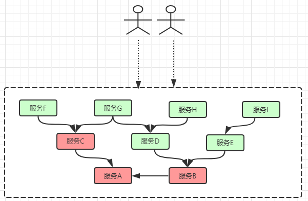**

- 情景4: 相同道理,由于服务之间有关联，所以会导致整个调用链上的所有服务都挂掉.
  
  **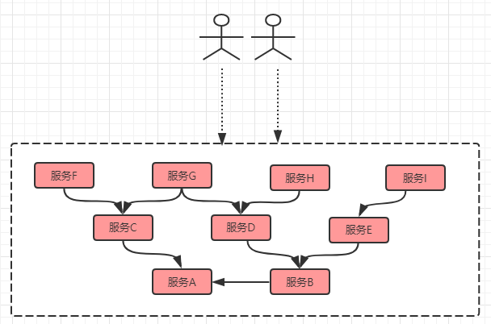**

   ​    服务器的雪崩效应其实就是由于某个微小的服务挂了,导致整一大片的服务都不可用.类似生活中的雪崩效应,由于落下的最后一片雪花引发了雪崩的情况.

   ​    雪崩发生的原因多种多样，有不合理的容量设计，或者是高并发下某一个方法响应变慢，亦或是某台机器的资源耗尽。我们无法完全杜绝雪崩源头的发生，只有做好足够的容错，保证在一个服务发生问题，不会影响到其它服务的正常运行。

## 6.2 常见容错方案

​    要防止雪崩的扩散，我们就要做好服务的容错，容错说白了就是保护自己不被猪队友拖垮的一些措施, 下面介绍常见的服务容错思路和组件。

**常见的容错思路**

常见的容错思路有**隔离、超时、限流、熔断、降级**这几种，下面分别介绍一下。

- **隔离机制**: 比如服务A内限制有100个线程, 现在服务A可能会调用服务B,服务C,服务D.我们在服务A进行远程调用的时候,给不同的服务分配固定的线程,不会把所有线程都分配给某个微服务. 比如调用服务B分配30个线程,调用服务C分配30个线程，调用服务D分配40个线程. 这样进行资源的隔离，保证即使下游某个服务挂了，也不至于把服务A的线程消耗完。比如服务B挂了，这时候最多只会占用服务A的30个线程,服务A还有70个线程可以调用服务C和服务D.
  
  **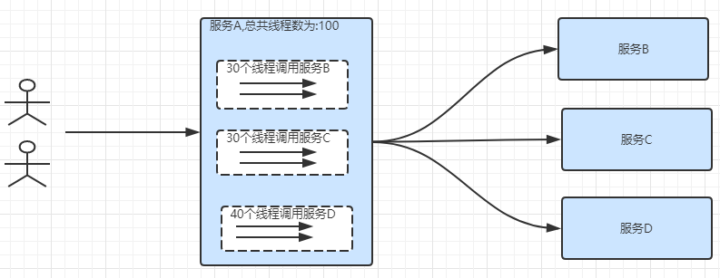**

- **超时机制**: 在上游服务调用下游服务的时候，设置一个最大响应时间，如果超过这个时间，下游未作出反应，
  
  就断开请求，释放掉线程。
  
  **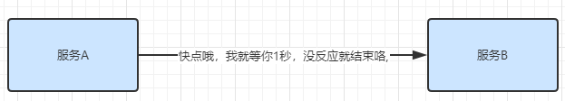**

- **限流机制**: 限流就是限制系统的输入和输出流量已达到保护系统的目的。为了保证系统的稳固运行,一旦达到
  
  的需要限制的阈值,就需要限制流量并采取少量措施以完成限制流量的目的。
  
  **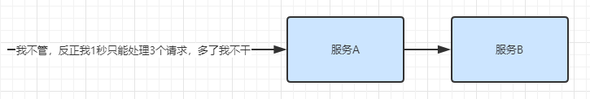**

- **熔断机制**: 在互联网系统中，当下游服务因访问压力过大而响应变慢或失败，上游服务为了保护系统整
  
  体的可用性，可以暂时切断对下游服务的调用。这种牺牲局部，保全整体的措施就叫做熔断。
  
  **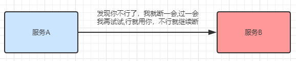**
  
  服务熔断一般有三种状态：
  
  - 熔断关闭状态（Closed）
  
  服务没有故障时，熔断器所处的状态，对调用方的调用不做任何限制
  
  - 熔断开启状态（Open）
  
  后续对该服务接口的调用不再经过网络，直接执行本地的fallback方法
  
  - 半熔断状态（Half-Open）
  
  尝试恢复服务调用，允许有限的流量调用该服务，并监控调用成功率。如果成功率达到预
  
  期，则说明服务已恢复，进入熔断关闭状态；如果成功率仍旧很低，则重新进入熔断开启状
  
  态。

- **降级机制**: 降级其实就是为服务提供一个兜底方案，一旦服务无法正常调用，就使用兜底方案。

**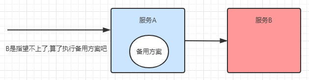**

## 6.3 常见的容错组件

- **Hystrix**
  
  Hystrix是由Netflflix开源的一个延迟和容错库，用于隔离访问远程系统、服务或者第三方库，防止

级联失败，从而提升系统的可用性与容错性。

- **Resilience4J**
  
  Resilicence4J一款非常轻量、简单，并且文档非常清晰、丰富的熔断工具，这也是Hystrix官方推

荐的替代产品。不仅如此，Resilicence4j还原生支持Spring Boot 1.x/2.x，而且监控也支持和

prometheus等多款主流产品进行整合。

- **Sentinel**
  
  Sentinel 是阿里巴巴开源的一款断路器实现，本身在阿里内部已经被大规模采用，非常稳定。

## 6.4 Sentinel入门

### 6.4.1 什么是Sentinel

**官网：https://sentinelguard.io/zh-cn/index.html**

Sentinel (分布式系统的流量防卫兵) 是阿里开源的一套用于**服务容错**的综合性解决方案。它以流量

为切入点, 从**流量控制、熔断降级、系统负载保护**等多个维度来保护服务的稳定性

Sentinel 具有以下特征:

- **丰富的应用场景**：Sentinel 承接了阿里巴巴近 10 年的双十一大促流量的核心场景, 例如秒杀（即

突发流量控制在系统容量可以承受的范围）、消息削峰填谷、集群流量控制、实时熔断下游不可用

应用等。

- **完备的实时监控**：Sentinel 提供了实时的监控功能。通过控制台可以看到接入应用的单台机器秒

级数据, 甚至 500 台以下规模的集群的汇总运行情况。

- **广泛的开源生态**：Sentinel 提供开箱即用的与其它开源框架/库的整合模块, 例如与 Spring

Cloud、Dubbo、gRPC 的整合。只需要引入相应的依赖并进行简单的配置即可快速地接入

Sentinel。

**Sentinel分为两个部分**:

- 核心库（Java 客户端）不依赖任何框架/库,能够运行于所有 Java 运行时环境，同时对 Dubbo /

Spring Cloud 等框架也有较好的支持。

- 控制台（Dashboard）基于 Spring Boot 开发，打包后可以直接运行，不需要额外的 Tomcat 等

应用容器。

### 6.4.2 订单微服务集成Sentinel

为微服务集成Sentinel非常简单, 只需要加入Sentinel的依赖即可

在shop-order-server项目的pom文件中添加如下依赖

```xml
<!--sentinel组件-->
<dependency>
    <groupId>com.alibaba.cloud</groupId>
    <artifactId>spring-cloud-starter-alibaba-sentinel</artifactId>
</dependency>
```

### 6.4.3 安装Sentinel控制台

Sentinel 提供一个轻量级的控制台, 它提供机器发现、单机资源实时监控以及规则管理等功能。

1. **下载jar包 https://github.com/alibaba/Sentinel/releases**

2. **启动控制台**
   
   ```shell
   # 直接使用jar命令启动项目(控制台本身是一个SpringBoot项目) 
   java -Dserver.port=8080 -Dcsp.sentinel.dashboard.server=localhost:8080 -Dproject.name=sentinel-dashboard -jar sentinel-dashboard-1.8.0.jar
   ```
   
   ```properties
   -Dserver.port=8080 #用于指定 Sentinel 控制台端口为 8080，如若8080端口冲突，可使用 -Dserver.port=新端口 进行设置。。
   -Dcsp.sentinel.dashboard.server=localhost:8080 #指定控制台地址和端口，会自动向该地址发送心跳包。地址格式为：hostIp:port #配置成ocalhost:8080即监控自己
   -Dproject.name=sentinel-dashboard #指定Sentinel控制台程序显示的名称
   ```
   
   **这里注意：**
   
   ```java
   // 指定jdk版本
   set Path=jdk8以上版本\bin
   ```

3. **修改shop-order-server项目中的配置文件application.yml,新增如下配置:**
   
   ```yaml
   spring:
     cloud:
       sentinel: 
         transport: 
           port: 8719 #跟控制台交流的端口,随意指定一个未使用的端口即可,默认为8719
           dashboard: localhost:8080 # 指定控制台服务的地址
   ```

4. **通过浏览器访问localhost:8080 进入控制台 ( 默认用户名密码是 sentinel/sentinel )**
   
   注意: 默认是没显示order-service的，需要访问几次接口，然后再刷新sentinel管控台才可以看到.
   
   **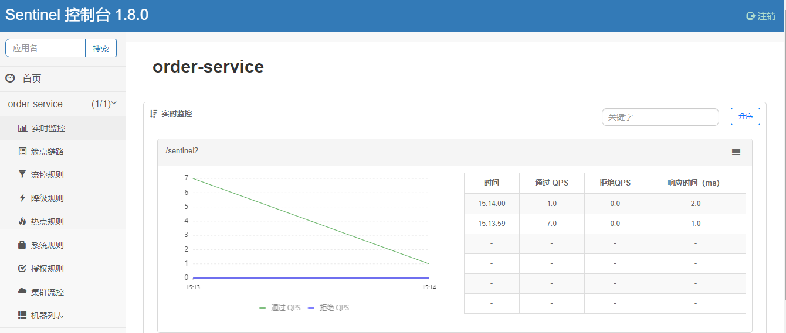**

### 6.4.4 实现一个接口的限流

**第一步: 簇点链路--->流控**

**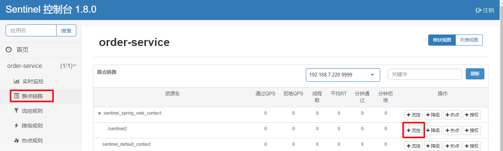**

**第二步: 在单机阈值填写一个数值，表示每秒上限的请求数**

**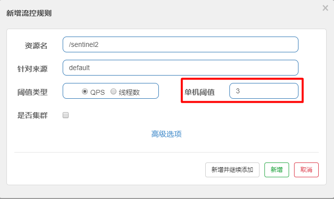**

**第三步:通过控制台快速频繁访问, 观察效果**

**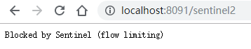**

### 6.4.5 Sentinel容错的维度

**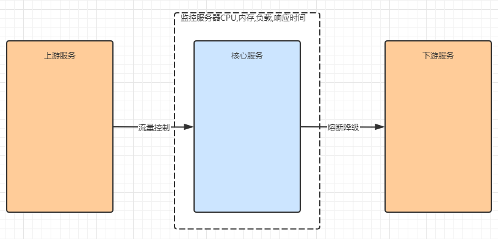**

**流量控制**：流量控制在网络传输中是一个常用的概念，它用于调整网络包的数据。任意时间到来的请求往往是随机不可控的，而系统的处理能力是有限的。我们需要根据系统的处理能力对流量进行控制。

**熔断降级**：当检测到调用链路中某个资源出现不稳定的表现，例如请求响应时间长或异常比例升高的时候，则对这个资源的调用进行限制，让请求快速失败，避免影响到其它的资源而导致级联故障。

**系统负载保护**：Sentinel 同时提供系统维度的自适应保护能力。当系统负载较高的时候，如果还持续让请求进入可能会导致系统崩溃，无法响应。在集群环境下，会把本应这台机器承载的流量转发到其它的机器上去。如果这个时候其它的机器也处在一个边缘状态的时候，Sentinel 提供了对应的保护机制，让系统的入口流量和系统的负载达到一个平衡，保证系统在能力范围之内处理最多的请求。

### 6.4.6 Sentinel规则种类

Sentinel主要提供了这五种的流量控制，接下来我们每种都给同学们演示一下.

**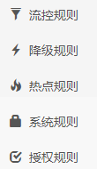**

### 6.4.7 Sentinel控制实现原理


## 6.5 Sentinel规则-流控

### 6.5.1 流控规则

流量控制，其原理是监控应用流量的QPS(每秒查询率) 或并发线程数等指标，当达到指定的阈值时

对流量进行控制，以避免被瞬时的流量高峰冲垮，从而保障应用的高可用性。

**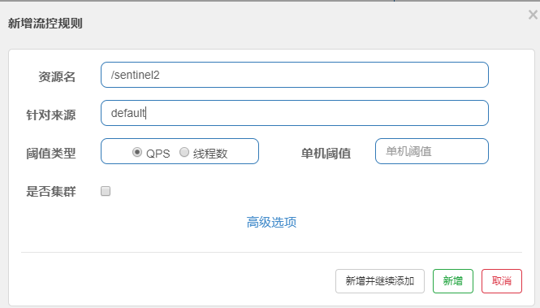**

**资源名**：唯一名称，默认是请求路径，可自定义

**针对来源**：指定对哪个微服务进行限流，默认指default，意思是不区分来源，全部限制

**阈值类型/单机阈值**：

- QPS（每秒请求数量）: 当调用该接口的QPS达到阈值的时候，进行限流

- 线程数：当调用该接口的线程数达到阈值的时候，进行限流

**是否集群**：暂不需要集群

#### 6.5.1.1 QPS流控

前面6.4.4案例就是演示的QPS流控

#### 6.5.1.2 线程数流控

1. 删除掉之前的QPS流控，新增线程数流控
   
   **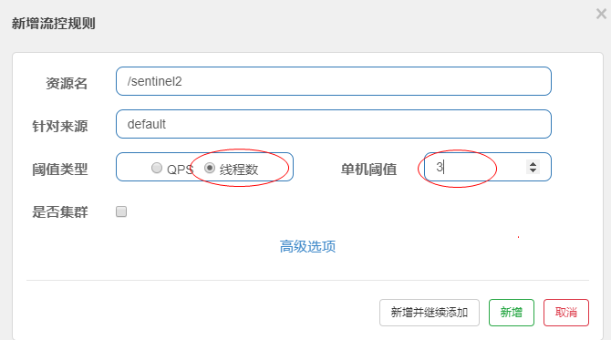**

2. 在Jmeter中新增线程
   
   **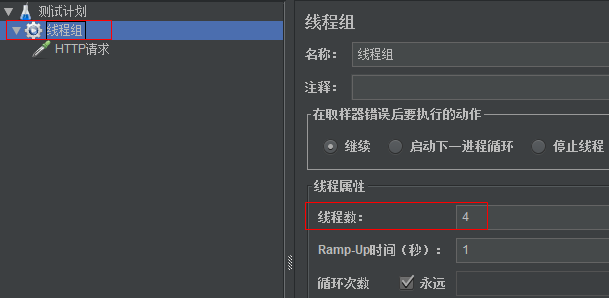**
   
   **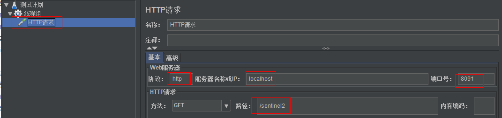**

3. 访问 http://localhost:8091/sentinel2 会发现已经被限流
   
   **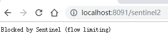**

### 6.5.2 流控模式

点击上面设置流控规则的**编辑**按钮，然后在编辑页面点击**高级选项**，会看到有流控模式一栏。

**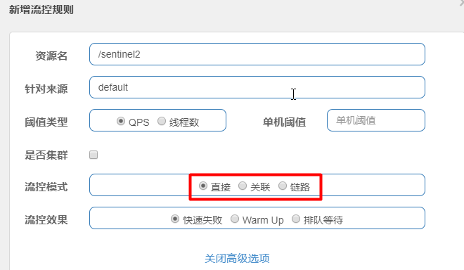**

sentinel共有三种流控模式，分别是：

- 直接（默认）：接口达到限流条件时，开启限流

- 关联：当关联的资源达到限流条件时，开启限流 [适合做应用让步]

- 链路：当从某个接口过来的资源达到限流条件时，开启限流

#### 6.5.2.1 直接流控模式

前面演示的案例就是这种.

#### 6.5.2.2 关联流控模式

关联流控模式指的是，当指定接口关联的接口达到限流条件时，开启对指定接口开启限流。

**场景**:当两个资源之间具有资源争抢或者依赖关系的时候，这两个资源便具有了关联。比如对数据库同一个字段的读操作和写操作存在争抢，读的速度过高会影响写得速度，写的速度过高会影响读的速度。如果放任读写操作争抢资源，则争抢本身带来的开销会降低整体的吞吐量。可使用关联限流来避免具有关联关系的资源之间过度的争抢.

1. **在SentinelController.java中增加一个方法，重启订单服务**
   
   ```java
   @RequestMapping("/sentinel3")
   public String sentinel3(){
       return "sentinel3";
   }
   ```

2. **配置限流规则, 将流控模式设置为关联，关联资源设置为的 /sentinel2**
   
   **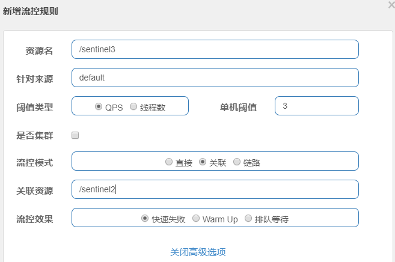**

3. 通过postman软件向/sentinel2连续发送请求，注意QPS一定要大于3
   
   **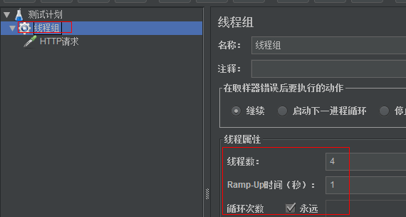**
   
   **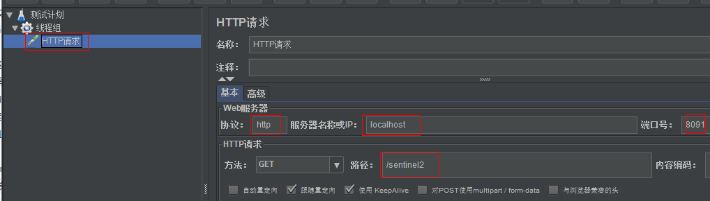**

4. **访问/sentinel3,会发现已经被限流**
   
   **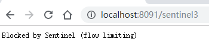**

#### 6.5.2.3 链路流控模式

链路流控模式指的是，当从某个接口过来的资源达到限流条件时，开启限流。

1. **在shop-order-server项目的application.yml文件中新增如下配置:**
   
   ```yaml
   spring:
     cloud:
       sentinel:
         web-context-unify: false
   ```

2. **在shop-order-server项目中新增TraceServiceImpl.java**
   
   ```java
   package cn.wolfcode.service.impl;
   @Service
   @Slf4j
   public class TraceServiceImpl {
       @SentinelResource(value = "tranceService")
       public void tranceService(){
           log.info("调用tranceService方法");
       }
   }
   ```

3. **在shop-order-server项目中新增TraceController.java**
   
   ```java
   package cn.wolfcode.controller;
   @RestController
   public class TraceController {
       @Autowired
       private TraceServiceImpl traceService;
       @RequestMapping("/trace1")
       public String trace1(){
           traceService.tranceService();
           return "trace1";
       }
       @RequestMapping("/trace2")
       public String trace2(){
           traceService.tranceService();
           return "trace2";
       }
   }
   ```

4. **重新启动订单服务并添加链路流控规则**
   
   **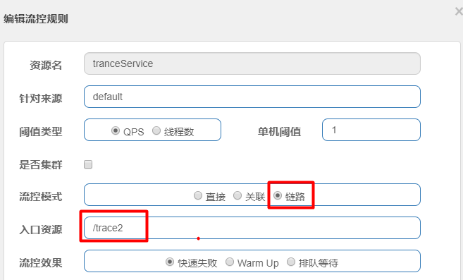**

5. **分别通过 /trace1 和 /trace2 访问, 发现/trace1没问题, /trace2的被限流了**
   
   **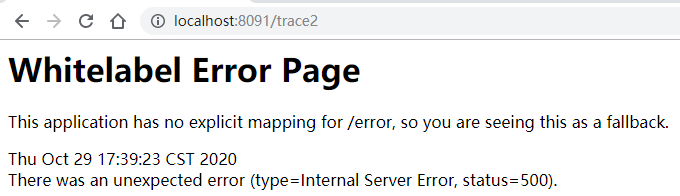**

### 6.5.3 流控效果

- **快速失败（默认）**: 直接失败，抛出异常，不做任何额外的处理，是最简单的效果

- **Warm Up**：它从开始阈值到最大QPS阈值会有一个缓冲阶段，一开始的阈值是最大QPS阈值的
  
  1/3，然后慢慢增长，直到最大阈值，适用于将突然增大的流量转换为缓步增长的场景。

- **排队等待**：让请求以均匀的速度通过，单机阈值为每秒通过数量，其余的排队等待； 它还会让设
  
  置一个超时时间，当请求超过超时间时间还未处理，则会被丢弃。

## 6.6 Sentinel规则-降级

降级规则就是设置当满足什么条件的时候，对服务进行降级。Sentinel提供了三个衡量条件：

- **慢调用比例**: 选择以慢调用比例作为阈值，需要设置允许的慢调用 RT（即最大的响应时间），请求的响应时间大于该值则统计为慢调用。当单位统计时长内请求数目大于设置的最小请求数目，并且慢调用的比例大于阈值，则接下来的熔断时长内请求会自动被熔断。经过熔断时长后熔断器会进入探测恢复状态（HALF-OPEN 状态），若接下来的一个请求响应时间小于设置的慢调用 RT 则结束熔断，若大于设置的慢调用 RT 则会再次被熔断。
- **异常比例**: 当单位统计时长内请求数目大于设置的最小请求数目，并且异常的比例大于阈值，则接下来的熔断时长内请求会自动被熔断。经过熔断时长后熔断器会进入探测恢复状态（HALF-OPEN 状态），若接下来的一个请求成功完成（没有错误）则结束熔断，否则会再次被熔断。异常比率的阈值范围是 `[0.0, 1.0]`，代表 0% - 100%。
- **异常数**：当单位统计时长内的异常数目超过阈值之后会自动进行熔断。经过熔断时长后熔断器会进入探测恢复状态（HALF-OPEN 状态），若接下来的一个请求成功完成（没有错误）则结束熔断，否则会再次被熔断。

### 6.6.1 慢调用比例案例

1. **在shop-order-server项目中新增FallBackController.java类,代码如下:**
   
   ```java
   package cn.wolfcode.controller;
   @RestController
   @Slf4j
   public class FallBackController {
       @RequestMapping("/fallBack1")
       public String fallBack1(){
           try {
               log.info("fallBack1执行业务逻辑");
               //模拟业务耗时
               TimeUnit.SECONDS.sleep(1);
           } catch (InterruptedException e) {
               e.printStackTrace();
           }
           return "fallBack1";
       }
   }
   ```

2. **新增降级规则:**
   
   **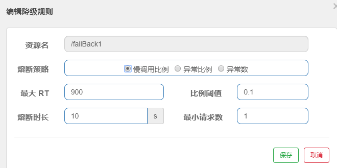**
   
   上面配置表示，如果在1S之内,有【超过1个的请求】且这些请求中【响应时间>最大RT】的【请求数量比例>10%】，就会触发熔断，在接下来的10s之内都不会调用真实方法，直接走降级方法。
   
   比如: 最大RT=900,比例阈值=0.1,熔断时长=10,最小请求数=10
   
   - 情况1: 1秒内的有20个请求，只有10个请求响应时间>900ms, 那慢调用比例=0.5，这种情况就会触发熔断
   
   - 情况2: 1秒内的有20个请求，只有1个请求响应时间>900ms, 那慢调用比例=0.05，这种情况不会触发熔断
   
   - 情况3: 1秒内的有8个请求，只有6个请求响应时间>900ms, 那慢调用比例=0.75，这种情况不会触发熔断，因为最小请求数这个条件没有满足.
   
   **注意**: 我们做实验的时候把最小请求数设置为1，因为在1秒内，手动操作很难在1s内发两个请求过去，所以要做出效果,最好把最小请求数设置为1。

### 6.6.2 异常比例案例

1. **在shop-order-server项目的FallBackController.java类新增fallBack2方法:**
   
   ```java
   int i=0;
   @RequestMapping("/fallBack2")
   public String fallBack2(){
       log.info("fallBack2执行业务逻辑");
       //模拟出现异常，异常比例为33%
       if(++i%3==0){
           throw new RuntimeException();
       }
       return "fallBack2";
   }
   ```

2. **新增降级规则:**
   
   **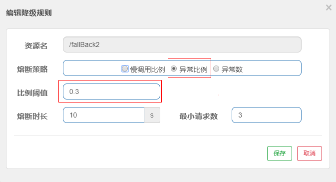**
   
   上面配置表示，在1s之内，,有【超过3个的请求】，异常比例30%的情况下，触发熔断，熔断时长为10s.

### 6.3.3 异常数案例

1. **在shop-order-server项目的FallBackController.java类新增fallBack3方法:**
   
   ```java
   @RequestMapping("/fallBack3")
   public String fallBack3(String name){
       log.info("fallBack3执行业务逻辑");
       if("wolfcode".equals(name)){
           throw new RuntimeException();
       }
       return "fallBack3";
   }
   ```

2. **新增降级规则**
   
   **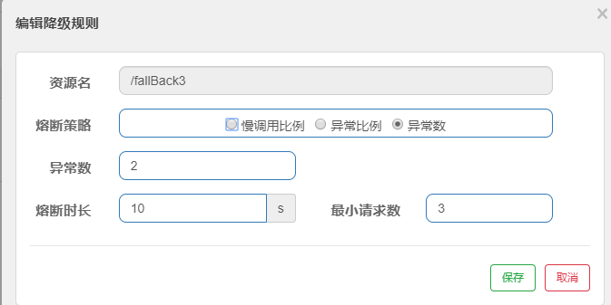**
   
   上面配置表示，在1s之内，,有【超过3个的请求】，请求中超过2个请求出现异常就会触发熔断，熔断时长为10s

## 6.7 Sentinel规则-热点

何为热点？热点即经常访问的数据。很多时候我们希望统计某个热点数据中访问频次最高的 Top K 数据，并对其访问进行限制。比如：

- 商品 ID 为参数，统计一段时间内最常购买的商品 ID 并进行限制
- 用户 ID 为参数，针对一段时间内频繁访问的用户 ID 进行限制

热点参数限流会统计传入参数中的热点参数，并根据配置的限流阈值与模式，对包含热点参数的资源调用进行限流。热点参数限流可以看做是一种特殊的流量控制，仅对包含热点参数的资源调用生效。

1. **在shop-order-server项目中新增HotSpotController.java,代码如下:**
   
   ```java
   package cn.wolfcode.controller;
   @RestController
   @Slf4j
   public class HotSpotController {
       @RequestMapping("/hotSpot1")
       @SentinelResource(value = "hotSpot1")
       public String hotSpot1(Long productId){
           log.info("访问编号为:{}的商品",productId);
           return "hotSpot1";
       }
   }
   ```
   
   注意:一定需要在请求方法上贴@SentinelResource直接，否则热点规则无效

2. **新增热点规则:**
   
   **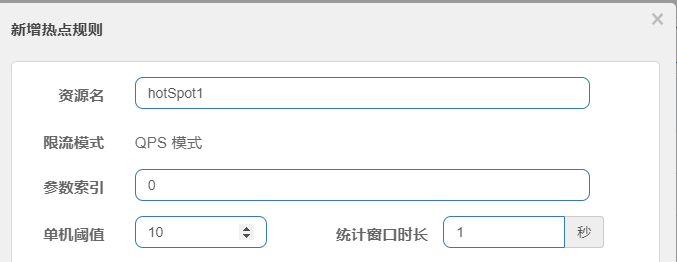**

3. **在热点规则中编辑规则,在编辑之前一定要先访问一下/hotSpot1,不然参数规则无法新增.**
   
   **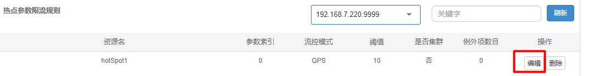**

4. **新增参数规则:**
   
   **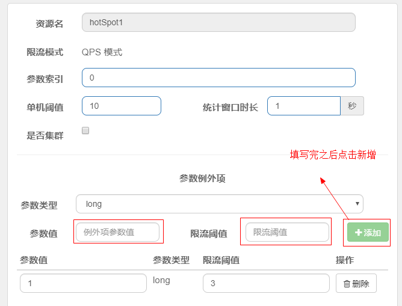**

5. **点击保存，可以看到已经新增了参数规则.**
   
   **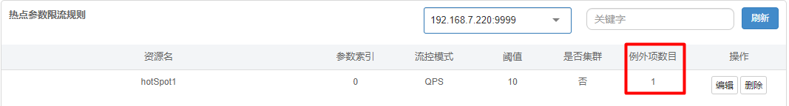**

6. **访问测试**
   
   访问http://localhost:8091/hotSpot?productId=1 访问会降级
   
   访问http://localhost:8091/hotSpot?productId=2 访问不会降级
   
   **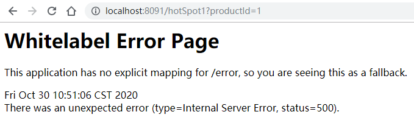**

## 6.8 Sentinel规则-授权

很多时候，我们需要根据调用来源来判断该次请求是否允许放行，这时候可以使用 Sentinel 的来源访问控制（黑白名单控制）的功能。来源访问控制根据资源的请求来源（`origin`）限制资源是否通过，若配置白名单则只有请求来源位于白名单内时才可通过；若配置黑名单则请求来源位于黑名单时不通过，其余的请求通过。

1. **在shop-order-server中新建RequestOriginParserDefinition.java,定义请求来源如何获取**
   
   ```java
   @Component
   public class RequestOriginParserDefinition implements RequestOriginParser {
       @Override
       public String parseOrigin(HttpServletRequest request) {
           /**
            *  定义从请求的什么地方获取来源信息
            *  比如我们可以要求所有的客户端需要在请求头中携带来源信息
            */
           String serviceName = request.getParameter("serviceName");
           return serviceName;
       }
   }
   ```

2. **在shop-order-server中新建AuthController.java,代码如下:**
   
   ```java
   @RestController
   @Slf4j
   public class AuthController {
       @RequestMapping("/auth1")
       public String auth1(String serviceName){
           log.info("应用:{},访问接口",serviceName);
           return "auth1";
       }
   }
   ```

3. **新增授权规则**
   
   **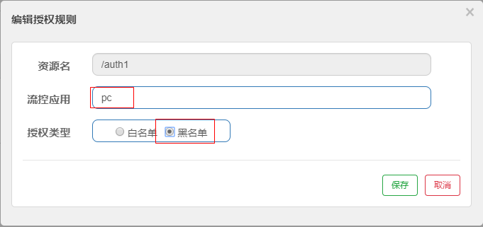**

4. **访问测试**
   
   访问http://localhost:8091/auth1?serviceName=pc 不能访问
   
   访问http://localhost:8091/auth1?serviceName=app 可以访问
   
   **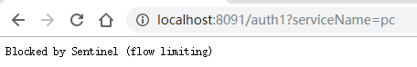**

## 6.9 Sentinel规则-系统规则

系统保护规则是从应用级别的入口流量进行控制，从单台机器的 load、CPU 使用率、平均 RT、入口 QPS 和并发线程数等几个维度监控应用指标，让系统尽可能跑在最大吞吐量的同时保证系统整体的稳定性。

系统保护规则是应用整体维度的，而不是资源维度的，并且**仅对入口流量生效**。入口流量指的是进入应用的流量（`EntryType.IN`），比如 Web 服务或 Dubbo 服务端接收的请求，都属于入口流量。

系统规则支持以下的模式：

- **Load 自适应**（仅对 Linux/Unix-like 机器生效）：系统的 load1 作为启发指标，进行自适应系统保护。当系统 load1 超过设定的启发值，且系统当前的并发线程数超过估算的系统容量时才会触发系统保护（BBR 阶段）。系统容量由系统的 `maxQps * minRt` 估算得出。设定参考值一般是 `CPU cores * 2.5`。
- **CPU usage**（1.5.0+ 版本）：当系统 CPU 使用率超过阈值即触发系统保护（取值范围 0.0-1.0），比较灵敏。
- **平均 RT**：当单台机器上所有入口流量的平均 RT 达到阈值即触发系统保护，单位是毫秒。
- **并发线程数**：当单台机器上所有入口流量的并发线程数达到阈值即触发系统保护。
- **入口 QPS**：当单台机器上所有入口流量的 QPS 达到阈值即触发系统保护。

**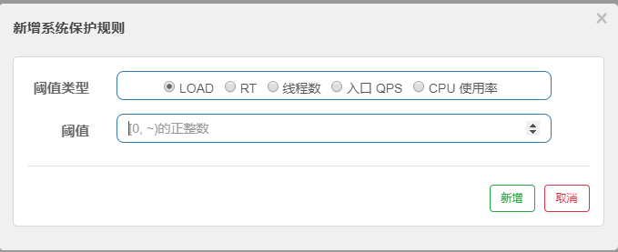**

## 6.10  Sentinel 自定义异常返回

当前面设定的规则没有满足是，我们可以自定义异常返回.

- FlowException 限流异常 

- DegradeException 降级异常 

- ParamFlowException 参数限流异常 

- AuthorityException 授权异常 

- SystemBlockException 系统负载异常

在shop-order-server项目中定义异常返回处理类

```java
package cn.wolfcode.error;
@Component
public class ExceptionHandlerPage implements BlockExceptionHandler {
    @Override
    public void handle(HttpServletRequest request, HttpServletResponse response, BlockException e) throws Exception {
        response.setContentType("application/json;charset=utf-8");
        ResultData data = null;
        if (e instanceof FlowException) {
            data = new ResultData(-1, "接口被限流了");
        } else if (e instanceof DegradeException) {
            data = new ResultData(-2, "接口被降级了");
        }else if (e instanceof ParamFlowException) {
            data = new ResultData(-3, "参数限流异常");
        }else if (e instanceof AuthorityException) {
            data = new ResultData(-4, "授权异常");
        }else if (e instanceof SystemBlockException) {
            data = new ResultData(-5, "系统负载异常了...");
        }
        response.getWriter().write(JSON.toJSONString(data));
    }
}
@Data
@AllArgsConstructor//全参构造
@NoArgsConstructor//无参构造
class ResultData {
    private int code;
    private String message;
}
```

## 6.11 @SentinelResource的使用

在定义了资源点之后，我们可以通过Dashboard来设置限流和降级策略来对资源点进行保护。同时还能

通过@SentinelResource来指定出现异常时的处理策略。

@SentinelResource 用于定义资源，并提供可选的异常处理和 fallback 配置项。

其主要参数如下:

| 属性                                 | 作用                                                                                                                                                                                                                                                                                                                                                                                                                   |
|:---------------------------------- | -------------------------------------------------------------------------------------------------------------------------------------------------------------------------------------------------------------------------------------------------------------------------------------------------------------------------------------------------------------------------------------------------------------------- |
| value                              | 资源名称，必需项（不能为空）                                                                                                                                                                                                                                                                                                                                                                                                       |
| entryType                          | entry 类型，可选项（默认为 `EntryType.OUT`）                                                                                                                                                                                                                                                                                                                                                                                    |
| blockHandler` / `blockHandlerClass | `blockHandler` 对应处理 `BlockException` 的函数名称，可选项。blockHandler 函数访问范围需要是 `public`，返回类型需要与原方法相匹配，参数类型需要和原方法相匹配并且最后加一个额外的参数，类型为 `BlockException`。blockHandler 函数默认需要和原方法在同一个类中。若希望使用其他类的函数，则可以指定 `blockHandlerClass` 为对应的类的 `Class` 对象，注意对应的函数必需为 static 函数，否则无法解析。                                                                                                                                                       |
| fallback` / `fallbackClass         | fallback 函数名称，可选项，用于在抛出异常的时候提供 fallback 处理逻辑。fallback 函数可以针对所有类型的异常（除了 `exceptionsToIgnore` 里面排除掉的异常类型）进行处理。fallback 函数签名和位置要求：<br />1. 返回值类型必须与原函数返回值类型一致； <br />2.方法参数列表需要和原函数一致，或者可以额外多一个 `Throwable` 类型的参数用于接收对应的异常。<br />3.fallback 函数默认需要和原方法在同一个类中。若希望使用其他类的函数，则可以指定 `fallbackClass` 为对应的类的 `Class` 对象，注意对应的函数必需为 static 函数，否则无法解析。                                                                           |
| `defaultFallback`                  | 默认的 fallback 函数名称，可选项，通常用于通用的 fallback 逻辑（即可以用于很多服务或方法）。默认 fallback 函数可以针对所有类型的异常（除了 `exceptionsToIgnore` 里面排除掉的异常类型）进行处理。若同时配置了 fallback 和 defaultFallback，则只有 fallback 会生效。defaultFallback 函数签名要求：<br />1. 返回值类型必须与原函数返回值类型一致；<br />2. 方法参数列表需要为空，或者可以额外多一个 `Throwable` 类型的参数用于接收对应的异常。 <br />3. defaultFallback 函数默认需要和原方法在同一个类中。若希望使用其他类的函数，则可以指定 `fallbackClass` 为对应的类的 `Class` 对象，注意对应的函数必需为 static 函数，否则无法解析。 |
| `exceptionsToIgnore`               | 用于指定哪些异常被排除掉，不会计入异常统计中，也不会进入 fallback 逻辑中，而是会原样抛出。                                                                                                                                                                                                                                                                                                                                                                   |

**定义限流和降级后的处理方法**

直接将限流和降级方法定义在方法中

```java
package cn.wolfcode.controller;
@RestController
@Slf4j
public class AnnoController {
    @RequestMapping("/anno1")
    @SentinelResource(value = "anno1",
            blockHandler="anno1BlockHandler",
            fallback = "anno1Fallback"
    )
    public String anno1(String name){
        if("wolfcode".equals(name)){
            throw new RuntimeException();
        }
        return "anno1";
    }
    public String anno1BlockHandler(String name,BlockException ex){
        log.error("{}", ex);
        return "接口被限流或者降级了";
    }
    //Throwable时进入的方法
    public String anno1Fallback(String name,Throwable throwable) {
        log.error("{}", throwable);
        return "接口发生异常了";
    }
}
```

## 6.12 Feign整合Sentinel

1. **在shop-order-server项目的配置文件中开启feign对Sentinel的支持**
   
   ```yaml
   feign:
     sentinel:
       enabled: true
   ```

2. **创建容错类**
   
   ```java
   @Component
   public class ProductFeignFallBack implements IProductFeginService {
      @Override
      public Product findByPid(Long pid) {
          Product product = new Product();
          product.setPid(-1L);
          product.setPname("兜底数据");
          product.setPprice(0.0);
          return product;
      }
   }
   ```

3. **在feign接口中定义容错类**
   
   ```java
   @FeignClient(name = "product-service",fallback = ProductFeignFallBack.class)
   public interface ProductFeignApi {
       @RequestMapping("/product/{pid}")
       public Product findByPid(@PathVariable("pid") Long pid);
   }
   ```

4. **停止所有 商品服务,重启 shop-order 服务,访问请求,观察容错效果**
   
   **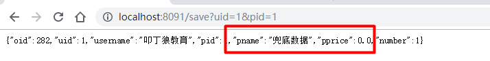**

可能上面的案例并不是特别恰当，我们只是通过案例来演示Feign集成Sentinel实现降级的效果. 接下来我们具体更贴切的案例来讲解Feign降级的作用.

比如我们在购物的时候，查看商品详情页面的时候，里面包含库存信息,商品详情信息,评论信息，这个需求包含的微服务如下:

**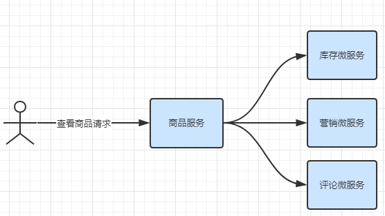**

假设现在评论服务宕机了,那是不是意味用户发出查看商品请求也无法正常显示了，商品都看不到了，那用户也无法进行下单的操作了. 但是对于用户来说，评论看不到并不影响他购物，所以这时候我们应该对评论服务进行及·降级处理，返回一个兜底数据(空数据)，这样用户的查看商品请求能正常显示，只是评论数据看不到而已，这样的话，用户的下单请求也不会受到影响.

# 第七章 服务网关Gateway

大家都都知道在微服务架构中，一个系统会被拆分为很多个微服务。那么作为客户端要如何去调用

这么多的微服务呢？如果没有网关的存在，我们只能在客户端记录每个微服务的地址，然后分别去调

用。

**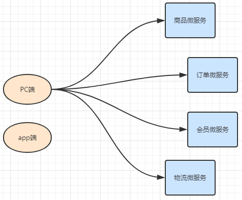**

这样的架构，会存在着诸多的问题：

- 客户端多次请求不同的微服务，增加客户端代码或配置编写的复杂性

- 认证复杂，每个服务都需要独立认证。

- 微服务做集群的情况下，客户端并没有负责均衡的功能

上面的这些问题可以借助**API网关**来解决。

所谓的API网关，就是指系统的**统一入口**，它封装了应用程序的内部结构，为客户端提供统一服

务，一些与业务本身功能无关的公共逻辑可以在这里实现，诸如认证、鉴权、监控、路由转发等等。

添加上API网关之后，系统的架构图变成了如下所示：

**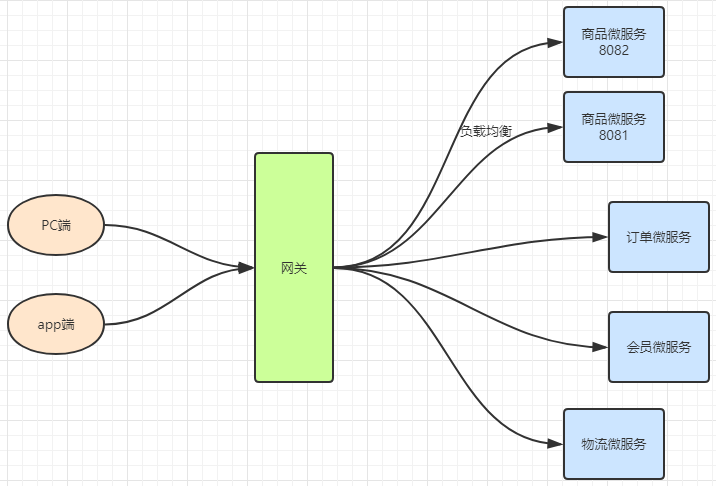**

网关是如何知道微服务的地址?网关如何进行负载均衡呢？

网关需要将自己的信息注册到注册中心上并且拉取其他微服务的信息，然后再调用的时候基于Ribbon实现负载均衡。

网关的作用：

**1>请求分发  2>负载均衡  3>过滤拦截   4>网络隔离**

## 7.1 常见网关介绍

- **Nginx+lua**

使用nginx的反向代理和负载均衡可实现对api服务器的负载均衡及高可用,lua是一种脚本语言,可以来编写一些简单的逻辑, nginx支持lua脚本

- **Kong**

基于Nginx+Lua开发，性能高，稳定，有多个可用的插件(限流、鉴权等等)可以开箱即用。 问题：只支持Http协议；二次开发，自由扩展困难；提供管理API，缺乏更易用的管控、配置方式。

- **Zuul** 

Netflix开源的网关，功能丰富，使用JAVA开发，易于二次开发 问题：缺乏管控，无法动态配置；依赖组件较多；处理Http请求依赖的是Web容器，性能不如Nginx,Spring Cloud Gateway

- **Gateway**

Spring公司为了替换Zuul而开发的网关服务

注意：SpringCloud alibaba技术栈中并没有提供自己的网关，我们可以采用Spring Cloud Gateway来做网关

## 7.2 Gateway简介

​    Spring Cloud Gateway是Spring公司基于Spring 5.0，Spring Boot 2.0 和 Project Reactor 等技术开发的网关，它旨在为微服务架构提供一种简单有效的统一的 API 路由管理方式。它的目标是替代Netflix Zuul，其不仅提供统一的路由方式，并且基于 Filter 链的方式提供了网关基本的功能，例如：安全，监控和限流。

**优点：**

- 性能强劲：是第一代网关Zuul的1.6倍

- 功能强大：内置了很多实用的功能，例如转发、监控、限流等

- 设计优雅，容易扩展

**缺点：**

- 其实现依赖Netty与WebFlux，不是传统的Servlet编程模型，学习成本高

- 不能将其部署在Tomcat、Jetty等Servlet容器里，只能打成jar包执行

- 需要Spring Boot 2.0及以上的版本，才支持

## 7.3 Gateway快速入门

1. **创建一个 shop-gateway 的模块,导入相关依赖**
   
   ```xml
   <?xml version="1.0" encoding="UTF-8"?>
   <project xmlns="http://maven.apache.org/POM/4.0.0"
            xmlns:xsi="http://www.w3.org/2001/XMLSchema-instance"
            xsi:schemaLocation="http://maven.apache.org/POM/4.0.0 http://maven.apache.org/xsd/maven-4.0.0.xsd">
       <parent>
           <artifactId>shop-parent</artifactId>
           <groupId>cn.wolfcode</groupId>
           <version>1.0.0</version>
       </parent>
       <modelVersion>4.0.0</modelVersion>
   
       <artifactId>api-gateway</artifactId>
       <dependencies>
           <!--gateway网关-->
           <dependency>
               <groupId>org.springframework.cloud</groupId>
               <artifactId>spring-cloud-starter-gateway</artifactId>
           </dependency>
           <!--nacos客户端-->
           <dependency>
               <groupId>com.alibaba.cloud</groupId>
               <artifactId>spring-cloud-starter-alibaba-nacos-discovery</artifactId>
           </dependency>
           <dependency>
               <groupId>org.projectlombok</groupId>
               <artifactId>lombok</artifactId>
           </dependency>
       </dependencies>
   </project>
   ```

2. **编写启动类**
   
   ```java
   @SpringBootApplication
   @EnableDiscoveryClient
   public class ApiGatewayServer {
       public static void main(String[] args) {
           SpringApplication.run(ApiGatewayServer.class,args);
       }
   }
   ```

3. **编写配置文件**
   
   ```yaml
   server:
     port: 9000
   spring:
     application:
       name: shop-gateway
     cloud:
       nacos:
         discovery:
           server-addr: localhost:8848
       gateway:
         discovery:
           locator:
             enabled: true # 让gateway可以发现nacos中的微服务
   ```

4. **启动测试**
   
   **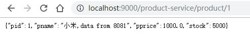**

## 7.4 自定义路由规则

1. **在application.yml中添加新的路由规则**
   
   ```yaml
   spring:
     cloud:
       gateway:
         routes:
           - id: product_route
             uri: lb://product-service 
             predicates:
               - Path=/product-serv/**
             filters:
               - StripPrefix=1
           - id: order_route
             uri: lb://order-service 
             predicates:
               - Path=/order-serv/**
             filters:
               - StripPrefix=1
   ```

2. **启动测试**
   
   **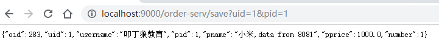**

## 7.5 Gateway概念

路由(Route) 是 gateway 中最基本的组件之一，表示一个具体的路由信息载体。主要定义了下面的几个

信息:

- **id**，路由标识符，区别于其他 Route。 

- **uri**，路由指向的目的地 uri，即客户端请求最终被转发到的微服务。

- **order**，用于多个 Route 之间的排序，数值越小排序越靠前，匹配优先级越高。

- **predicate**，断言的作用是进行条件判断，只有断言都返回真，才会真正的执行路由。

- **filter**，过滤器用于修改请求和响应信息。

执行流程图:

**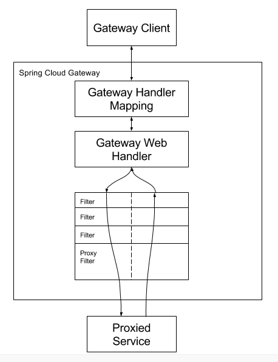**

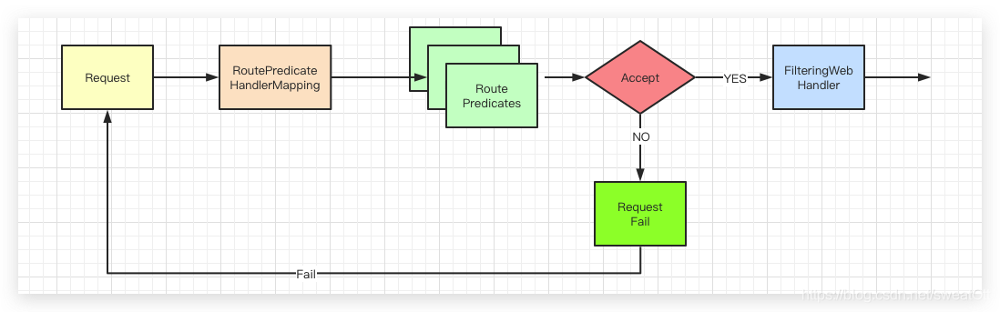

## 7.6 过滤器Filter

过滤器就是在请求的传递过程中,对请求和响应做一些手脚.

在Gateway中, Filter的生命周期只有两个：“pre” 和 “post”。

- PRE： 这种过滤器在请求被路由之前调用。我们可利用这种过滤器实现身份验证、在集群中选择

请求的微服务、记录调试信息等。

- POST：这种过滤器在路由到微服务以后执行。这种过滤器可用来为响应添加标准的HTTP

Header、收集统计信息和指标、将响应从微服务发送给客户端等。

在Gateway中，Filter的作用范围两种:

- GatewayFilter：应用到单个路由或者一个分组的路由上。
- GlobalFilter：应用到所有的路由上

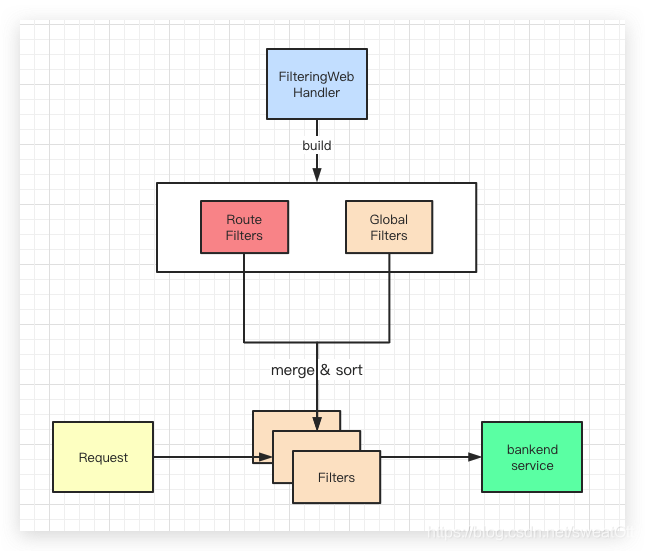

### 7.6.1 局部路由过滤器

局部过滤器是针对单个路由的过滤器,在SpringCloud Gateway中内置了很多不同类型的网关路由过滤器,有兴趣同学可以自行了解，这里太多了，我们就不一一讲解，我们主要来讲一下自定义路由过滤器。

需求: 统计订单服务调用耗时.

流程图

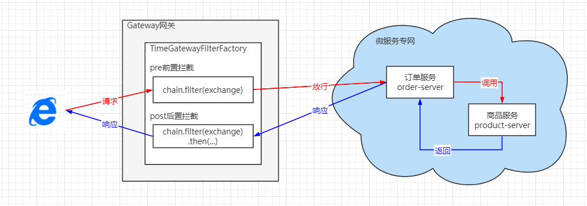

**1>编写Filter类，需要实现GatewayFilter接口，重写filter方法**

```java
package cn.wolfcode.filters;

import org.springframework.cloud.gateway.filter.GatewayFilter;
import org.springframework.cloud.gateway.filter.GatewayFilterChain;
import org.springframework.web.server.ServerWebExchange;
import reactor.core.publisher.Mono;

/**
 * 计算时间过滤器
 */
public class TimeGatewayFilter implements GatewayFilter, Ordered  {
    /**
     * 过滤逻辑
     * @param exchange 转换器--封装了来自请求中所有信息，比如：请求方法，请求参数，请求路径，请求头，cookie等
     * @param chain 过滤器链--使用责任链模式，决定当前过滤器是放行还是拒绝
     * @return Mono 响应式编程的返回值规范，一般后置拦截才会用
     */
    @Override
    public Mono<Void> filter(ServerWebExchange exchange, GatewayFilterChain chain) {
        //统计时间：进来(pre前置)记当前时间， 出去(post后置)记当前时间，2者差值就是运行时间
        long begin = System.currentTimeMillis();
        System.out.println("前置当前时间：" + begin);
        return chain.filter(exchange).then(Mono.fromRunnable(()->{
            long end = System.currentTimeMillis();
            System.out.println("后置当前时间：" + end);
            System.out.println("两者时间差：" + (end-begin));
        }));
    }
    @Override
    public int getOrder() {
        return 0;
    }
}
```

**2>往Gateway中注册自定义的filter类**

```java
/**
 * 注册时间统计过滤器
 * 要求：
 * 1>过滤器工厂名字必须按照规定格式，否则报错。
 *   格式： XxxGatewayFilterFactory， 其中Xxx 就是在yml中filters配置过滤器
 * 2>继承AbstractGatewayFilterFactory父类，明确指定一个泛型
 *   改泛型用于接受yml-filters配置的过滤器值
 */
@Component
public class TimeGatewayFilterFactory extends AbstractGatewayFilterFactory<Object> {
    @Override
    public GatewayFilter apply(Object config) {
        return new TimeGatewayFilter();
    }
}
```

**3>配置使用自定义filter类**

```yaml
server:
  port: 9000
spring:
  application:
    name: shop-gateway
  cloud:
    nacos:
      discovery:
        server-addr: localhost:8848
    gateway:
      discovery:
        locator:
          enabled: true 
      routes:
        - id: product_route
          uri: lb://product-service 
          predicates:
            - Path=/product-serv/**
          filters:
            - StripPrefix=1
        - id: order_route
          uri: lb://order-service 
          predicates:
            - Path=/order-serv/**
          filters:
            - StripPrefix=1
            - Time
```

**4>测试，访问订单服务save方法**

```java
前置当前时间：1666065937548
后置当前时间：1666065943803
两者时间差：6255
```

**拓展：如果想弄带参数过滤器，比如**：

```yaml
filters:
    - StripPrefix=1
    - Time=111,222
```

**1>定制接受参数的对象**

```java
@Getter
@Setter
public class TimeGatewayFilterParam {
    private String value1;
    private String value2;
}
```

**2>修改TimeGatewayFilter 过滤器类，获取Gateway传入的参数对象**

```java
/**
 * 计算时间过滤器
 */
public class TimeGatewayFilter implements GatewayFilter , Ordered  {

    private TimeGatewayFilterParam value;
    public TimeGatewayFilter(TimeGatewayFilterParam config){
        this.value = config;
    }

    /**
     * 过滤逻辑
     * @param exchange 转换器--封装了来自请求中所有信息，比如：请求方法，请求参数，请求路径，请求头，cookie等
     * @param chain 过滤器链--使用责任链模式，决定当前过滤器是放行还是拒绝
     * @return Mono 响应式编程的返回值规范，一般后置拦截才会用
     */
    @Override
    public Mono<Void> filter(ServerWebExchange exchange, GatewayFilterChain chain) {
        //统计时间：进来(前置)记当前时间， 出去(后置)记当前时间，2者差值就是运行时间
        long begin = System.currentTimeMillis();
        System.out.println(value.getValue1() + "前置当前时间：" + begin);
        return chain.filter(exchange).then(Mono.fromRunnable(()->{
            long end = System.currentTimeMillis();
            System.out.println(value.getValue2() + "后置当前时间：" + end);
            System.out.println("两者时间差：" + (end-begin));
        }));
    }
    @Override
    public int getOrder() {
        return 0;
    }
}
```

**3>在TimeGatewayFilterFactory 类中编写Gateway传入的参数对象逻辑**

```java
@Component
public class TimeGatewayFilterFactory extends AbstractGatewayFilterFactory<TimeGatewayFilterParam> {

    //指定获取配置参数之后封装成啥对象
    public TimeGatewayFilterFactory(){
        super(TimeGatewayFilterParam.class);
    }
    //将数据添加到哪个属性上
    @Override
    public List<String> shortcutFieldOrder() {
        return Arrays.asList("value1", "value2");
    }

    @Override
    public GatewayFilter apply(TimeGatewayFilterParam config) {
        return new TimeGatewayFilter(config);
    }
}
```

### 7.6.2 全局路由过滤器

全局过滤器作用于所有路由, 无需配置。通过全局过滤器可以实现对权限的统一校验，安全性验证等功

能。

SpringCloud Gateway内部也是通过一系列的内置全局过滤器对整个路由转发进行处理如下：

**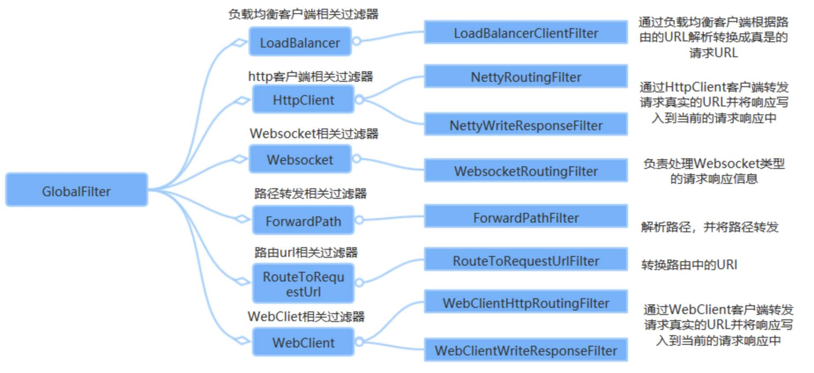**

需求: 实现统一鉴权的功能,我们需要在网关判断请求中是否包含token且，如果没有则不转发路由，有则执行正常逻辑。

**1>编写全局过滤类**

```java
package cn.wolfcode.filters;

import org.springframework.cloud.gateway.filter.GatewayFilterChain;
import org.springframework.cloud.gateway.filter.GlobalFilter;
import org.springframework.core.io.buffer.DataBuffer;
import org.springframework.http.HttpHeaders;
import org.springframework.http.HttpStatus;
import org.springframework.http.MediaType;
import org.springframework.http.server.reactive.ServerHttpResponse;
import org.springframework.stereotype.Component;
import org.springframework.util.StringUtils;
import org.springframework.web.server.ServerWebExchange;
import reactor.core.publisher.Mono;

import java.nio.charset.StandardCharsets;
import java.util.List;

@Component
public class AuthGlobalFilter  implements GlobalFilter {
    @Override
    public Mono<Void> filter(ServerWebExchange exchange, GatewayFilterChain chain) {


        String token = exchange.getRequest().getQueryParams().getFirst("token");
        ServerHttpResponse response = exchange.getResponse();
        if(!StringUtils.hasText(token)){
            //没登录
            System.out.println("没有登录");
            response.setStatusCode(HttpStatus.UNAUTHORIZED);
            //返回401状态
            //return response.setComplete();

            //但是一般访问接口应该返回json格式
            String ret = "{\"code\":401, \"msg\":\"没有登录\", \"data\":\"\"}";
            byte[] bits = ret.getBytes(StandardCharsets.UTF_8);
            //把字节数据转换成一个DataBuffer
            DataBuffer buffer = response.bufferFactory().wrap(bits);
            return response.writeWith(Mono.just(buffer));
        }

        return chain.filter(exchange);
    }
}
```

注意：如果中文乱码，需要加上响应头

```java
HttpHeaders httpHeaders = response.getHeaders();
//返回数据格式
httpHeaders.setContentType(MediaType.APPLICATION_JSON);
```

**2>启动并测试**

**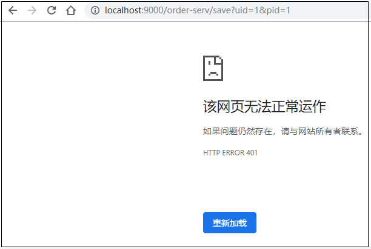**

**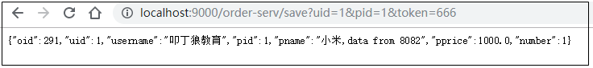**

## 7.7 集成Sentinel实现网关限流

网关是所有请求的公共入口，所以可以在网关进行限流，而且限流的方式也很多，我们本次采用前

面学过的Sentinel组件来实现网关的限流。Sentinel支持对SpringCloud Gateway、Zuul等主流网关进

行限流。

从1.6.0版本开始，Sentinel提供了SpringCloud Gateway的适配模块，可以提供两种资源维度的限流：

- route维度：即在Spring配置文件中配置的路由条目，资源名为对应的routeId

- 自定义API维度：用户可以利用Sentinel提供的API来自定义一些API分组

### 7.7.1 网关集成Sentinel

https://github.com/alibaba/Sentinel/wiki/网关限流

1. **添加依赖**
   
   ```xml
   <dependency>
       <groupId>com.alibaba.csp</groupId>
       <artifactId>sentinel-spring-cloud-gateway-adapter</artifactId>
   </dependency>
   <dependency>
       <groupId>com.alibaba.cloud</groupId>
       <artifactId>spring-cloud-starter-alibaba-sentinel</artifactId>
   </dependency>
   <dependency>
       <groupId>com.alibaba.cloud</groupId>
       <artifactId>spring-cloud-alibaba-sentinel-gateway</artifactId>
   </dependency>
   ```

2. **添加配置**
   
   ```yml
   spring:
     cloud:
       sentinel:
         transport:
           port: 8719
           dashboard: localhost:8080
   ```

### 7.7.2 API分组

Sentinel中支持按照API分组进行限流,就是我们可以按照特定规则进行限流.

在管控台页面中提供了三种方式的API分组管理

- 精准匹配
- 前缀匹配
- 正则匹配

以商品服务做测试案例，在shop-product-server服务中定义了如下的接口地址

```java
@RestController
@RequestMapping("/v1")
public class TestController {
    @RequestMapping("/test1")
    public String test1(){
        return "test1";
    }
    @RequestMapping("/test2")
    public String test2(){
        return "test2";
    }
    @RequestMapping("/test3/test")
    public String test3(){
        return "test3";
    }
}
```

**精准匹配**

1.在API管理中新建API分组，匹配模式选择精准匹配，匹配串写请求URL地址

限制api可以：product-service   也可以使product-serv， 测试时需要跟反问一样，另外注意通过网关访问

**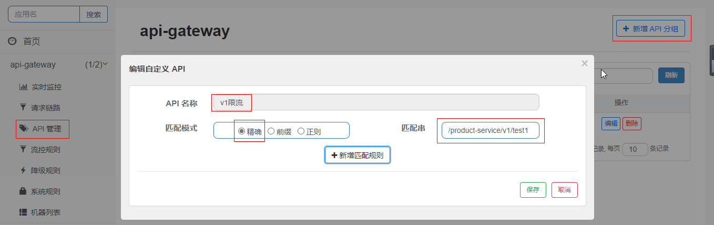**

2.在流控规则中，API类型中选择API分组，然后在API名称中选择我们刚刚定义的V1限流

**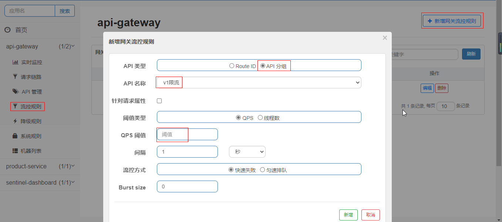**

3.此时上面三个请求中，只有`/product-service/v1/test1会被限流`

**前缀匹配**

1.在API管理中新建API分组，匹配模式选择前缀匹配，匹配串写请求URL地址

**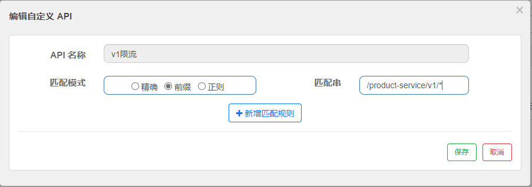**

此时`/product-service/v1/test1`和`/product-service/v1/test2`会被限流

注意: 如果路径为/*表示匹配一级路径，如果路径为/**表示多级路径

**正则匹配**

1.在API管理中新建API分组，匹配模式选择正则匹配，匹配串写请求URL地址

**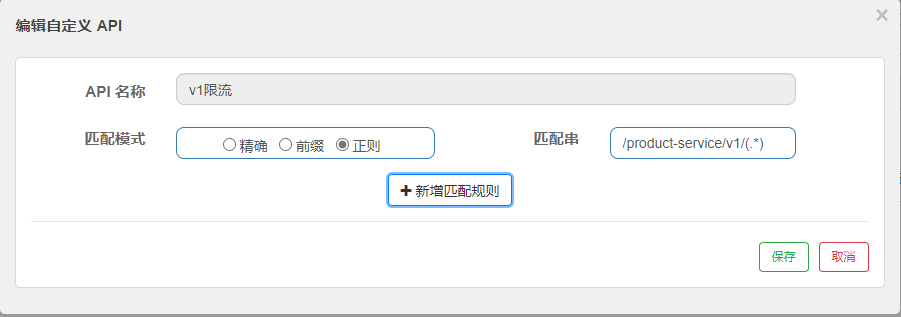**

此时所有路径都会被限流

### 7.7.3 修改限流默认返回格式

1. 在配置类GatewayConfiguration.java中添加如下配置
   
   ```java
   @PostConstruct
   public void initBlockHandlers() {
       BlockRequestHandler blockRequestHandler = new BlockRequestHandler() {
       public Mono<ServerResponse> handleRequest(ServerWebExchange serverWebExchange, Throwable throwable) {
           Map map = new HashMap<>();
           map.put("code", 0);
           map.put("message", "接口被限流了");
               return ServerResponse.status(HttpStatus.OK).
                   contentType(MediaType.APPLICATION_JSON).
                   body(BodyInserters.fromValue(map));
               }
   };
       GatewayCallbackManager.setBlockHandler(blockRequestHandler);
   }
   ```

2. 重启并测试
   
   **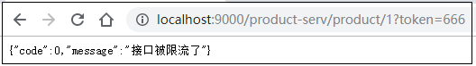**

## 7.8 Gateway总结

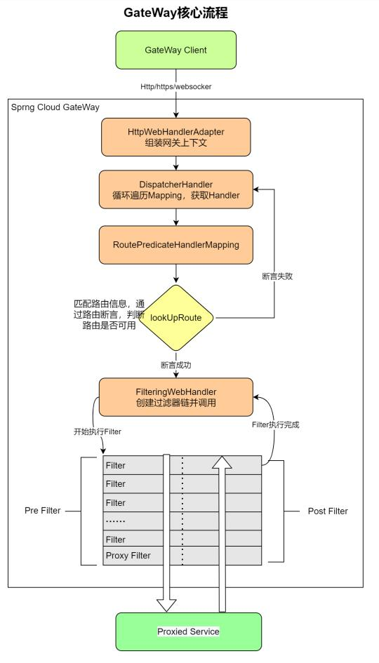

**Gateway执行流程**

1. `Gateway Client` 向 `Spring Cloud Gateway` 发送请求
2. 请求首先会被 `HttpWebHandlerAdapter` 进行提取组装成网关上下文
3. 然后网关的上下文会传递到 `DispatcherHandler` ，它负责将请求分发给 `RoutePredicateHandlerMapping`
4. `RoutePredicateHandlerMapping` 负责路由查找，并根据路由断言判断路由是否可用
5. 如果过断言成功，由`FilteringWebHandler` 创建过滤器链并调用
6. 通过特定于请求的 `Fliter` 链运行请求，`Filter` 被虚线分隔的原因是Filter可以在发送代理请求之前（pre）和之后（post）运行逻辑
7. 执行所有pre过滤器逻辑。然后进行代理请求。发出代理请求后，将运行“post”过滤器逻辑。
8. 处理完毕之后将 `Response` 返回到 `Gateway` 客户端

**Gateway过滤器**

- Filter在pre类型的过滤器可以做参数效验、权限效验、流量监控、日志输出、协议转换等。
- Filter在post类型的过滤器可以做响应内容、响应头的修改、日志输出、流量监控等

**核心思想**

- 路由转发+执行过滤器链

# 第八章 链路追踪 Sleuth&Zipkin

微服务架构是一个分布式架构，它按业务划分服务单元，一个分布式系统往往有很多个服务单元。由于服务单元数量众多，业务的复杂性，如果出现了错误和异常，很难去定位。主要体现在，一个请求可能需要调用很多个服务，而内部服务的调用复杂性，决定了问题难以定位。所以微服务架构中，必须实现分布式链路追踪，去跟进一个请求到底有哪些服务参与，参与的顺序又是怎样的，从而达到每个请求的步骤清晰可见，出了问题，很快定位。

分布式链路追踪（Distributed Tracing），就是将一次分布式请求还原成调用链路，进行日志记录，性能监控并将一次分布式请求的调用情况集中展示。比如各个服务节点上的耗时、请求具体到达哪台机器上、每个服务节点的请求状态等等。

## 8.1 常见的链路追踪技术

- **cat** ：由大众点评开源，基于Java开发的实时应用监控平台，包括实时应用监控，业务监控 。 集成方案是通过代码埋点的方式来实现监控，比如： 拦截器，过滤器等。 对代码的侵入性很大，集成成本较高。风险较大。

- **zipkin** ：由Twitter公司开源，开放源代码分布式的跟踪系统，用于收集服务的定时数据，以解决微服务架构中的延迟问题，包括：数据的收集、存储、查找和展现。该产品结合spring-cloud-sleuth使用较为简单， 集成很方便， 但是功能较简单。

- **pinpoint**： Pinpoint是韩国人开源的基于字节码注入的调用链分析，以及应用监控分析工具。特点是支持多种插件，UI功能强大，接入端无代码侵入。

- **skywalking**：SkyWalking是本土开源的基于字节码注入的调用链分析，以及应用监控分析工具。特点是支持多种插件，UI功能较强，接入端无代码侵入。目前已加入Apache孵化器。

- **Sleuth**
  
  SpringCloud 提供的分布式系统中链路追踪解决方案。

## 8.2 集成链路追踪组件Sleuth

1. **在product-server和order-server中添加sleuth依赖**
   
   ```xml
   <dependency>
       <groupId>org.springframework.cloud</groupId>
       <artifactId>spring-cloud-starter-sleuth</artifactId>
   </dependency>
   ```

2. **订单微服务调用商品微服务，这个流程中通过@Slfj打印日志.重启服务并访问测试**
   
   订单服务日志结果:
   
   **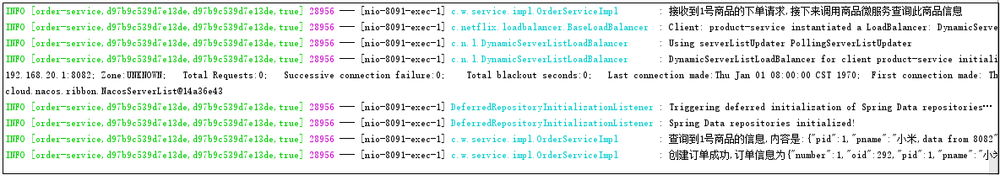**
   
   商品服务日志结果:
   
   **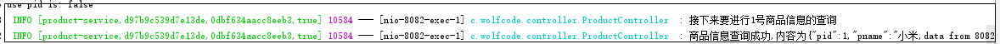**

## 8.3 日志参数解释

日志格式:
[order-server,c323c72e7009c077,fba72d9c65745e60,false] 

1、第一个值，spring.application.name的值

2、第二个值，c323c72e7009c077 ，sleuth生成的一个ID，叫Trace ID，用来标识一条请求链路，一条请求链路中包含一个Trace ID，多个Span ID

3、第三个值，fba72d9c65745e60、spanID 基本的工作单元，获取元数据，如发送一个http

4、第四个值：true，是否要将该信息输出到zipkin服务中来收集和展示。

## 8.4 Zipkin+Sleuth整合

zipkin是Twitter基于google的分布式监控系统Dapper（论文）的开发源实现，zipkin用于跟踪分布式服务之间的应用数据链路，分析处理延时，帮助我们改进系统的性能和定位故障。

官网:https://zipkin.io/

1. **下载Zipkin的jar包，在官网可以下载.**

2. **通过命令行，输入下面的命令启动ZipKin Server**
   
   ```shell
   java -jar zipkin-server-2.22.1-exec.jar
   ```

3. 通过浏览器访问 http://localhost:9411访问
   
   **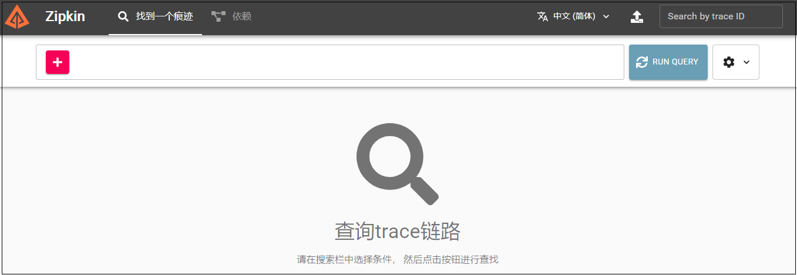**

4. **在订单微服务和商品微服务中添加zipkin依赖**
   
   ```xml
   <dependency>
       <groupId>org.springframework.cloud</groupId>
       <artifactId>spring-cloud-starter-zipkin</artifactId>
   </dependency>
   ```

5. **在订单微服务和商品微服务中添加如下配置:**
   
   ```yaml
   spring:
     zipkin:
       base-url: http://127.0.0.1:9411/ #zipkin server的请求地址
       discoveryClientEnabled: false #让nacos把它当成一个URL，而不要当做服务名
     sleuth: 
       sampler: 
         probability: 1.0 #采样的百分比
   ```

6. **重启订单微服务和商品微服务,**访问 http://localhost:8091/save?uid=1&pid=1

7. **访问zipkin的UI界面，观察效果**
   
   **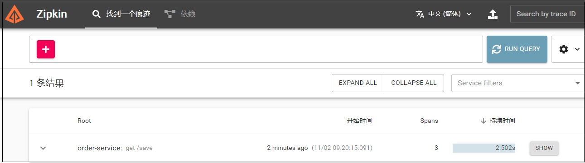**
   
   **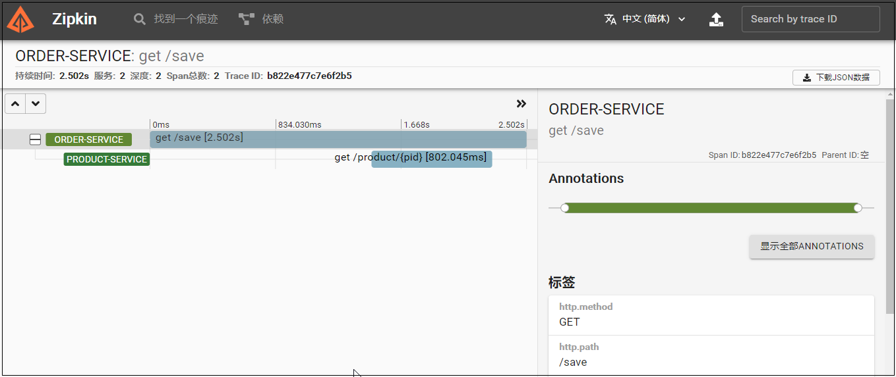**

# 第九章 配置中心 Nacos Config

## 9.1 服务配置中心介绍

首先我们来看一下,微服务架构下关于配置文件的一些问题：

1. 配置文件相对分散。在一个微服务架构下，配置文件会随着微服务的增多变的越来越多，而且分散

在各个微服务中，不好统一配置和管理。

2. 配置文件无法区分环境。微服务项目可能会有多个环境，例如：测试环境、预发布环境、生产环

境。每一个环境所使用的配置理论上都是不同的，一旦需要修改，就需要我们去各个微服务下手动

维护，这比较困难。

3. 配置文件无法实时更新。我们修改了配置文件之后，必须重新启动微服务才能使配置生效，这对一

个正在运行的项目来说是非常不友好的。

基于上面这些问题，我们就需要**配置中心**的加入来解决这些问题。

**配置中心的思路是**：

首先把项目中各种配置全部都放到一个集中的地方进行统一管理，并提供一套标准的接口。

当各个服务需要获取配置的时候，就来配置中心的接口拉取自己的配置。

当配置中心中的各种参数有更新的时候，也能通知到各个服务实时的过来同步最新的信息，使之动

态更新。

当加入了服务配置中心之后，我们的系统架构图会变成下面这样：

**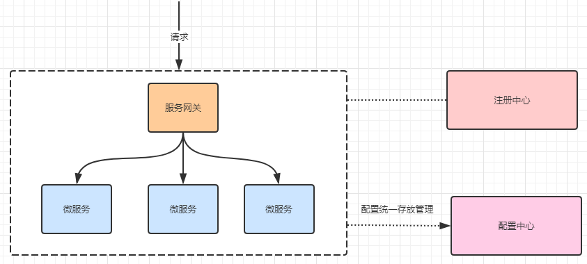**

## 9.2 常见的服务配置中心

- **Apollo**

Apollo是由携程开源的分布式配置中心。特点有很多，比如：配置更新之后可以实时生效，支持灰

度发布功能，并且能对所有的配置进行版本管理、操作审计等功能，提供开放平台API。并且资料

也写的很详细。

- **Disconf**

Disconf是由百度开源的分布式配置中心。它是基于Zookeeper来实现配置变更后实时通知和生效

的。

- **SpringCloud Config**

这是Spring Cloud中带的配置中心组件。它和Spring是无缝集成，使用起来非常方便，并且它的配

置存储支持Git。不过它没有可视化的操作界面，配置的生效也不是实时的，需要重启或去刷新。

- **Nacos**

这是SpingCloud alibaba技术栈中的一个组件，前面我们已经使用它做过服务注册中心。其实它也

集成了服务配置的功能，我们可以直接使用它作为服务配置中心。

## 9.3 Nacos Config入门

使用nacos作为配置中心，其实就是将nacos当做一个服务端，将各个微服务看成是客户端，我们将各个微服务的配置文件统一存放在nacos上，然后各个微服务从nacos上拉取配置即可。接下来我们以商品微服务为例，学习nacos config的使用。

1. **搭建nacos环境【使用现有的nacos环境即可】**

2. **在商品微服务中引入nacos的依赖**
   
   ```xml
   <dependency>
       <groupId>com.alibaba.cloud</groupId>
       <artifactId>spring-cloud-starter-alibaba-nacos-config</artifactId> 
   </dependency>
   ```

3. **在微服务中添加nacos config的配置**
   
   **注意**:不能使用原来的`application.yml`作为配置文件，而是新建一个`bootstrap.yml`作为配置文件
   
   ```
   配置文件优先级(由高到低):
   bootstrap.properties -> bootstrap.yml -> application.properties -> application.yml
   ```
   
   ```yaml
   spring:
     application:
       name: product-service
     cloud:
       nacos:
         config:
           server-addr: 127.0.0.1:8848 #nacos中心地址
           file-extension: yaml # 配置文件格式
     profiles: 
         active: dev # 环境标识
   ```

4. **在nacos中添加配置,然后把商品微服务application.yml配置复制到配置内容中.**
   
   **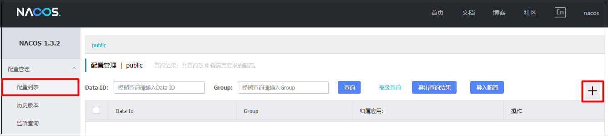**
   
   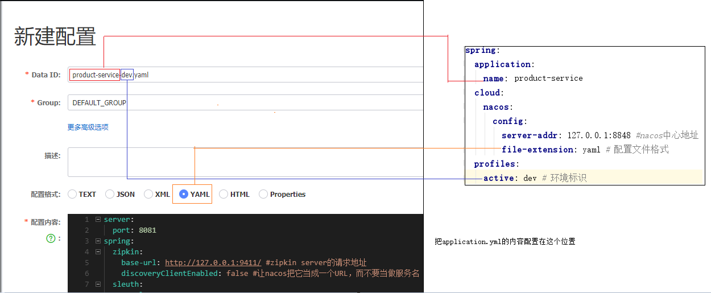

5. **注释本地的application.yam中的内容， 启动程序进行测试**

6. **如果依旧可以成功访问程序，说明我们nacos的配置中心功能已经实现**

**操作原理：**

观察启动后打印的日志，大体能看出操作原理

1>项目启动，先加载bootstrap.yml解析里面配置，得到3个核心信息

- 服务名：product-service
- nacos配置中心地址：127.0.0.1:8848
- 激活环境：dev

2>访nacos配置中心找项目的配置文件

没有指定具体分组默认：DEFAULT_GROUP

组 + 服务名 + 激活换--->DEFAULT_GROUP--product-service-dev.yaml 完全可以找到配置文件


## 9.4 配置动态刷新

所谓的动态刷新：项目运行中，手动改了nacos中的配置，项目在不停机的情况下也可以读到最新的数据。

操作步骤：

**1>在nacos中的product-service-dev.yaml配置项中添加下面配置:**

```yaml
appConfig:
  name: product2022
```

**2>在商品微服务中新增NacosConfigControlller.java**

```java
@RestController
@RefreshScope
public class NacosConfigController {
    @Value("${appConfig.name}")
    private String appConfigName;
    @RequestMapping("/nacosConfig")
    public String nacosConfig(){
        return "远程信息:"+appConfigName;
    }
}
```

注意：

必须贴上@RefreshScope 在类上才有效果

**@RefreshScope 操作原理：**当配置发生更新时，贴有@RefreshScope注解的类会重新IOC创建新的对象，该类中加载的数据重新更新。

## 9.5 配置共享

### 9.5.1 配置环境

真实项目开发一般会有3套部署环境，

**开发：**dev，配置是开发的环境，比如开发环境数据库四要素，Redis环境等。

**测试：**test，配置是开发的环境，比如测试环境数据库四要素，Redis环境等。

**生产：**prod，配置是开发的环境，比如生产环境数据库四要素，Redis环境等。

所以在项目开发时，必须编写3个配置环境文件

```properties
appliction-dev.yaml  #开发
appliction-test.yaml #测试
appliction-prod.yaml #生产
```

同时项目启动前需要明确指定要激活环境

```yaml
spring:
  profiles:
    active: dev # 环境标识
```

按这个标准，上面的案例还需要在nacos中创建2个配置文件

```properties
product-service-test.yaml
product-service-prod.yaml
```

nacos非常贴心，提供克隆功能

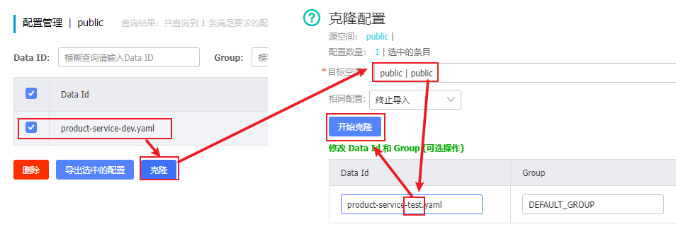

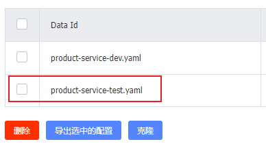*

### 9.5.2 环境配置文件共享

当环境多了，那对应的配置也会越来越多，这时你会发现有很多配置是重复的，此时就要考虑可不可以将相同配置提取出来，放置到一个共有文件中，然后实现共享呢？答案是Yes

**第一种场景：同一个微服务配置文件共享**

操作上非常简单，只需要写一个以：spring.application.name 命名的配置文件即可。

比如： 

application-dev.yaml ,application-test.yaml   ,application-prod.yaml   

提取公共文件名：**application.yaml**     看到没，没有后缀即可。

回到nacos的案例，只需要配置多一个文件：**product-service.yaml** 就可以啦。

**案例**

将之前的配置删掉：product-service-test.yaml  product-service-prod.yaml 

```yaml
appConfig:
  name: product2022
```

项目启动之后，报错

```yaml
spring:
  profiles:
    active: test # 环境标识
```

切换到test环境也报错，此时只需要额外添加一个配置文件：**product-service.yaml**

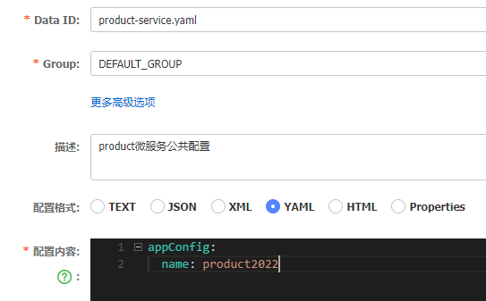*

**第二种场景：不同微服务中间配置文件共享**

不同为服务之间也可以实现配置共享，原理有点类似于文件引入，就是定义一个公共配置文件，然后在当前配置文件中引

入。

**操作步骤：**

1>在nacos中定义一个DataID为global-config.yaml的配置，用于所有微服务共享

```yaml
globalConfig: global
```

**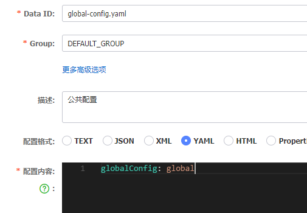**

2>修改bootstrap.yaml

```yaml
spring:
  application:
    name: product-service
  cloud:
    nacos:
      config:
        server-addr: 127.0.0.1:8848 #nacos中心地址
        file-extension: yaml # 配置文件格式
        shared-configs:
          - data-id: global-config.yaml # 配置要引入的配置
            refresh: true
  profiles:
    active: test # 环境标识
```

2>在NacosConfigController.java中新增一个方法

```java
@RestController
@RefreshScope
public class NacosConfigController {
    @Value("${appConfig.name}")
    private String appConfigName;
    @Value("${globalConfig}")
    private String globalConfig;

    @RequestMapping("/nacosConfig")
    public String nacosConfig(){
        return "远程信息:"+appConfigName;
    }

    @RequestMapping("/nacosConfig2")
    public String nacosConfig2(){
        return "全局配置:"+globalConfig;
    }
}
```

3>重启服务并测试.